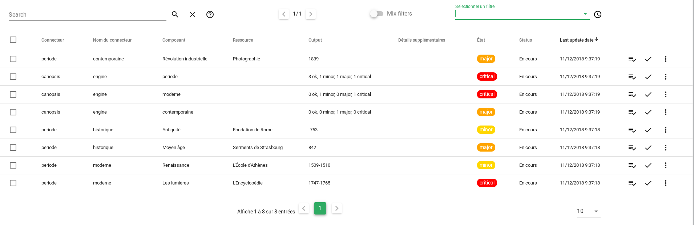

# Bac à alarmes

## Sommaire 

### Guide utilisateur

1. [Alarmes](#alarmes)
2. [Recherche](#recherche)
3. [Filtres](#filtres)
4. [Actions](#actions)
5. [Elements par page](#elements-par-page)

### Guide exploitant

1. [Aide sur les variables](#aide-variables)
2. [Paramètres du widget](#parametres-du-widget)

## Guide utilisateur

### Alarmes

Le tableau d'alarmes présente la liste des alarmes. Une ligne correspond à une alarme.
Les colonnes affichées sont personnalisables (*Cf: [Guide exploitant](#guide-exploitant)*).
En plus de détails de l'alarme, chaque ligne expose une liste d'actions opérables sur l'alarme (*Cf: [Actions](#actions)*).

Il est possible d'attacher à chaque colonne une Info popup, qui s'ouvrira au clic sur le texte de la colonne, présentant dans une fenêtre un texte personnalisable (*Cf: [Guide exploitant](#guide-exploitant)*).

Au clic sur une alarme (en dehors du texte des colonnes), l'historique de l'alarme s'affiche.

Cet historique reprend certains éléments du cycle de vie de l'alarme (notamment les actions effectuées sur celle-ci).

### Recherche

Le champ de recherche permet d'effectuer une recherche parmi les alarmes.

Pour effectuer une recherche 'simple', il suffit d'entrer les termes de la recherche dans le champ de texte, puis d'appuyer sur la touche Entrée, ou de cliquer sur l'icone 

Dans le bac à alarmes, il est possible d'effectuer des recherches plus avancées. Une aide concernant la syntaxe à utiliser est disponible en survolant avec la souris l'icone d'aide . Une documentation est également disponible pour cette aspect [ici](../../recherche/index.md) !

Pour supprimer la recherche, cliquez sur l'icone 
 
### Filtres

Le sélecteur de filtre permet d'appliquer un filtre sur le Bac à alarmes. Seules les alarmes correspondant aux critères du filtres seront affichées.

Pour sélectionner un filtre, il suffit de cliquer sur le champ 'Sélectionner un filtre'. Une liste des filtres disponibles apparaît.
Cliquez sur un filtre. Celui-ci est sélectionné et directement appliqué.
Pour ne plus appliquer de filtre, il suffit de cliquer sur l'icone présent au bout du champ de sélection de filtre. Le bac à alarmes se rafraichit, le champ de sélection revient dans état initial, le filtre n'est plus appliqué !

#### Mix filters

L'option "Mix filters", présente à gauche du sélecteur de filtre permet de cumuler plusieurs filtres.

Pour activer cette option, cliquez sur le bouton .
Une fois l'options activée, un sélecteur apparaît à droite du bouton d'activation . Ce sélecteur permet de choisir l'opérateur utilisé pour réunir les filtres.

- "AND": Les critères présents dans tout les filtres doivent êtres vérifiés
- "OR": Les critères présents dans un ou plusieurs des filtres doivent êtres vérifiés.

Une fois l'opérateur sélectionné, il ne vous reste plus qu'à sélectionner les filtres à appliquer dans le menu déroulant de sélection de filtres.

#### Filtres de période

Le filtre par période permet de filtre les alarmes en ne conservant que les alarmes d'une période donnée.

Ce filtre est disponible en cliquant sur l'icone  présente à droite du sélecteur de filtre. Une fenêtre apparaît.

Il suffit alors de sélectionner la période souhaitée parmi les périodes prédéfinies, ou d'en créer une personalisé en sélectionnant 'Personnalisé', puis en renseignant les dates de début et de fin.
Cliquez ensuite sur 'Appliquer'.

La fenêtre se ferme, le bac à alarmes se rafraîchit. Votre filtre par période est appliqué.
Celui-ci est visible en haut du Bac à alarmes.

Afin de supprimer ce filtre, cliquez sur le bouton de fermeture présent sur le filtre (*Cf Image ci-dessus*)

### Actions

Pour chaque alarme, des actions sont disponibles.

Pour le détail de chacune des actions, voir la [liste des actions du Bac à alarmes](./actions.md).

### Éléments par page

Le champ 'Eléments par page' permet de sélectionner le nombre d'alarmes à afficher sur chaque page.

Le choix par défaut est réglable dans les paramètres du bac à alarmes (*Cf: [Guide exploitant](#guide-exploitant)*)

## Guide exploitant

### Aide - Variables

Durant la configuration de votre widget Bac à alarmes, notamment paramètres "Info popup", et "Fenêtre Plus d'infos", il vous sera possible d'accéder à des variables concernant les alarmes et les entités.

Exemple: Il vous sera possible d'afficher, dans la fenêtre "Plus d'infos", l'état de l'alarme.

Afin de connaitre les variables disponibles, une modal d'aide est disponible.

Pour y accèder, entrez dans le mode d'édition (*Cf: [Vues - Mode d'édition](../../vues#mode-edition)*).

Un bouton d'action supplémentaire "Liste des variables disponibles" apparaît alors pour chaque alarme.

Au clic sur ce bouton, une fenêtre s'ouvre. Celle-ci liste toutes les variables disponibles dans vos différents paramètres. Un bouton, à droite de chacune des variables, vous permet de copier directement dans le Presse-papier le chemin de cette variable.

### Paramètres du widget

1. Taille du widget
2. Titre
3. Paramètres avancés
    1. Colonne de tri par défaut
    2. Nom des colonnes
    3. Nombre d'éléments par page par défaut
    4. Filtre sur open/resolved
    5. Filtres

#### Taille du widget (*requis*)

Ce paramètre permet de régler la taille du widget.

La première information à renseigner est la ligne dans laquelle le widget doit apparaître. Ce champ permet de rechercher parmi les lignes disponibles. Si aucune ligne n'est disponible, ou pour en créer une nouvelle, entrez son nom, puis appuyez sur la touche Entrée.

Ensuite, les 3 champs en dessous permettent de définir respectivement la largeur occupée par le widget sur mobile, tablette, de ordinateur de bureau.
La largeur maximale est de 12 colonnes pour un widget, la largeur minimale est de 3 colonnes.

#### Titre (*optionnel*)

Ce paramètre permet de définir le titre du widget, qui sera affiché au dessus de celui-ci.

Un champ de texte vous permet de définir ce titre.

#### Paramètres avancés

##### Colonne de tri par défaut

Ce paramètre permet de définir la colonne par laquelle trier les alarmes.

Un champ de texte vous permet d'abord de définir la colonne à utiliser. Il faut ici entrer la **valeur** de la colonne, et non son nom.

Exemple : pour trier sur la base de la colonne que vous avez nommée "Connecteur", avec comme valeur "v.connector" (*Cf: [Paramètre "Nom des colonnes"](#nom-des-colonnes)*), il faut entrer ici "v.connector" et non "Connecteur".

Une sélecteur vous permet ensuite de définir le sens de tri :

*  "ASC" = Ascendant
*  "DESC" = Descendant

##### Nom des colonnes

Ce paramètre permet de définir quels colonnes seront affichées dans le bac à alarmes.

Afin d'**ajouter une colonne**, cliquez sur le bouton 'Ajouter'.
Une colonne vide est alors ajoutée. Afin de finaliser l'ajout, il est nécessaire de remplir les champs demandés.

Le champ "Label" définit le nom de la colonne, qui sera affiché en haut de tableau. Le champ "Valeur" définit la valeur que doit prendre ce champ. Tous les champs de l'alarme et de l'entité concernée par l'alarme peuvent être utilisés.

Exemple : Pour ajouter une colonne ayant pour label "Composant" et pour valeur le nom du composant, renseignez les champs comme suit :

*  Label : "Composant"
*  Valeur : "alarm.v.component"

Pour supprimer une colonne, cliquez dans la liste des colonnes sur la croix rouge présente en haut à droite de la case de la colonne que vous souhaitez effacer.

Dans la liste des colonnes sont égalements présentes, pour chaque colonne, des flèches permettant de modifier l'ordre des colonnes. Les colonnes sont présentées dans l'ordre de haut en bas. Pour modifier la place d'une colonne, cliquez sur une des flèches. Pour faire monter/descendre une colonne dans la liste.

##### Nombre d'éléments par page par défaut

Ce paramètre permet de définir combien d'éléments seront affichés, par défaut, pour chaque page du bac à alarmes.

Pour modifier ce paramètre, sélectionnez simplement la valeur souhaitée.

Les valeurs disponibles sont : 5, 10, 20, 50 et 100.

##### Filtre sur Open/Resolved

Ce paramètre permet de filtrer les alarmes en fonction de leur état.

*  Open : Alarmes "Ouvertes"
*  Resolved : Alarmes "Résolues"

Pour modifier ce paramètre, sélectionnez les types d'alarmes que vous souhaitez afficher en cochant la case correspondante.
Il est possible de ne cocher aucune des cases (aucune alarme ne sera affichée), une des deux cases, ou les deux cases (les alarmes ouvertes ET résolues seront alors affichées).

##### Filtres

Ce paramètre permet de sélectionner un filtre à appliquer au bac à alarmes, et d'en créer de nouveaux.

Un champ de sélection permet d'abord de choisir un filtre à appliquer au bac à alarmes parmi les filtres existants. Sélectionnez le filtre que vous souhaitez appliquer parmi les filtres disponibles. Une fois les paramètres sauvegardés, le filtre sera appliquer au bac à alarmes (*Cf: [filtres](#filtres)*).

Pour créer un nouveau filtre, cliquez sur le bouton 'Ajouter'. Une fenêtre de création de filtre s'ouvre. Pour plus de détails sur les filtres et leur création, cliquez [ici](../../filtres/index.md).
Une fois votre filtre créé, celui-ci apparaît dans la liste disponible en dessous du sélecteur de filtre. Cette liste vous permet d'éditer ou de supprimer les filtres.

L'option "Mix filters" est également disponible depuis ce menu. Pour plus de détails concernant cette option, voir  [Mix filters](#mix-filters).

##### Info popup

Ce paramètre permet d'ajouter un info popup sur une des colonnes du Bac à alarmes (*Cf: [Infos popup - Guide utilisateur Bac à alarmes](#alarmes)*).

Pour ajouter une info popup, cliquez sur le bouton 'Ajouter'.

Une case info popup vide apparaît.
Cette case comporte deux champs :

*  Colonne : Ce champ permet de définir sur quelle colonne l'info popup sera disponible. Il faut ici entrer la **valeur** de la colonne, et non son nom.
Exemple : pour ajouter une info popup sur la colonne que vous avez nommée "Connecteur", avec comme valeur "alarm.v.connector" (*Cf: [Paramètre "Nom des colonnes"](#nom-des-colonnes)*), il faut entrer ici "alarm.v.connector" et non "Connecteur".
*  Texte : Ce champ, qui a la forme d'un éditeur de texte, permet de définir le contenu de l'info popup. Le langage utilisé ici pour le template de la popup est l'Handlebar. Deux variables sont disponibles : "alarm" et "entity". Exemple : Pour ajouter au template l'état de l'alarme, ajoutez au template `{{ alarm.v.state.val }}`.

Vous pouvez ajouter autant d'info popup que vous le souhaitez.

Pour supprimer une info popup, cliquez sur la croix rouge, en haut à droite de la case de l'info popup que vous souhaitez supprimer.

##### Fenêtre Plus d'infos

Ce paramètre permet de définir le contenu de la fenêtre plus d'infos. Le bouton permettant d'ouvrir cette fenêtre se trouve dans les actions de chaque alarme du bac à alarmes.

Ce champ se présente sous forme d'un éditeur de texte.
Le langage utilisé dans cet éditeur est le Handlebars.
Deux variables sont disponibles ici, 'alarm' et 'entity'.

En plus du texte que vous souhaitez afficher, il vous est donc possible d'intégrer des informations de l'alarme ou de l'entité concernée par cette alarme.

Exemple : Pour afficher l'état de l'alarme, ajoutez `{{ alarm.v.state.val }}`.
