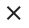

# Bac à alarmes

## Sommaire 

### Guide utilisateur
1. [Alarmes](#alarmes)
2. [Recherche](#recherche)
3. [Filtres](#filtres)
4. [Actions](#actions)

### Guide exploitant
1. [Paramètres du widget](#parametres-du-widget)

## Guide utilisateur

### Alarmes

// TODO EXPLICATION TABLEAU ALARMES + PAGINATION + ELEMENTS PAR PAGE + TIMELINE

### Recherche

Le champ de recherche permet d'effectuer une recherche parmi les alarmes.

Pour effectuer une recherche 'simple', il suffit d'entrer les termes de la recherche dans le champs de texte, puis d'appuyer sur la touche Entrée, ou de cliquer sur l'icone 

Dans le bac à alarmes, il est possible d'effectuer des recherches plus avancées. Une aide concernant la syntaxe à utiliser est disponible en survolant avec la souris l'icone d'aide . Une documentation est également disponible pour cette aspect [ici](../../recherche/index.md) !

Pour supprimer la recherche, cliquez sur l'icone 
 
### Filtres

Le sélecteur de filtre permet d'appliquer un filtre sur le Bac à alarmes. Seuls les alarmes correspondant aux critères du filtres seront affichées.

Pour sélectionner un filtre, il suffit de cliquer sur le champs 'Sélectionner un filtre'. Une liste des filtres disponibles apparaît.
Cliquez sur un filtre. Celui-ci est sélectionné, et directement appliqué.
Pour ne plus appliquer de filtre, il suffit de cliquer sur l'icone présent au bout du champ de sélection de filtre. Le bac à alarme se rafraichit, le champ de sélection revient dans état initial, le filtre n'est plus appliqué !

#### Filtres de période

Le filtre par période permet de filtre les alarmes en ne conservant que les alarmes d'une période donnée.

Ce filtre est disponible en cliquant sur l'icone  présent à droite du sélecteur de filtre. Une fenêtre apparaît.

Il suffit alors de sélectionner la période souhaitée parmis les périodes prédéfinies, ou d'en créer une personalisé en sélectionnant 'Personnalisé', puis en renseignant les dates de début et de fin.
Cliquez ensuite sur 'Appliquer'.

La fenêtre se ferme, le bac à alarme se rafraichit. Votre filtre par période est appliqué.
Celui-ci est visible en haut du Bac à alarmes.

Afin de supprimer ce filtre, cliquez sur le bouton de fermeture présent sur le filtre (*Cf Image ci-dessus*)

### Actions

Pour chaque alarme, des actions sont disponibles.

Pour le détail de chacune des actions, voir la [liste des actions du Bac à alarmes](./actions.md).

## Paramètres du widget

1. Taille du widget
2. Titre
3. Paramètres avancés
    1. Colonne de trie par défaut
    2. Nom des colonnes
    3. Nombre d'éléments par page par défaut
    4. Filtre sur open/resolved
    5. Filtres

### Taille du widget (*requis*)

Ce paramètre permet de régler la taille du widget.

La première information à renseigner est la ligne dans laquelle le widget doit apparaitre. Ce champ permet de rechercher parmis les lignes disponibles. Si aucune ligne n'est disponible, ou pour en créer une nouvelle, entrez son nom, puis appuyez sur la touche Entrée.

Ensuite, les 3 champs en dessous permettent de définir respectivement la largeur occupée par le widget sur mobile, tablette, de ordinateur de bureau.
La largeur maximale est de 12 colonnes pour un widget, la largeur minimale est de 3 colonnes.

### Titre (*optionnel*)

Ce paramètre permet de définir le titre du widget, qui sera affiché au dessus de celui-ci.

Un champ de texte vous permet de définir ce titre.

### Paramètres avancés
#### Colonne de tri par défaut

Ce paramètre permet de définir la colonne par laquelle trier les alarmes.

// INSERER IMAGE SETTING COLONNE TRIE PAR DEFAUT

Un champs de texte vous permet d'abord de définir la colonne à utiliser. Il ici entrer la **valeur** de la colonne, et non son nom.
Example : pour trier sur la base de la colonne que vous avez nommée "Connecteur", avec comme valeur "v.connector" (*Cf: [Paramètre "Nom des colonnes"](#nom-des-colonnes)*), il faut entrer ici "v.connector" et non "Connecteur".

Une sélecteur vous permet ensuite de définir le sens de tri :

- "ASC" = Ascendant
- "DESC" = Descendant

#### Nom des colonnes

Ce paramètre permet de définir quels colonnes seront affichées dans le bac à alarmes.

// INSERER IMAGE SETTING NOM DES COLONNES

Afin d'**ajouter une colonne**, cliquez sur le bouton 'Ajouter'.
Une colonne vide est alors ajoutée. Afin de finaliser l'ajout, il est nécessaire de remplir les champs demandés.
Le champ "Label" définit le nom de la colonne, qui sera affiché en haut de tableau. Le champ "Valeur" définit la valeur que doit prendre ce champs. Tout les champs de l'alarmes, et de l'entité concernée par l'alarme peuvent être utilisés, en préfixant le nom du champs de "alarm", ou de "entity".

Example: Pour ajouter une colonne ayant pour label "Composant" et pour valeur le nom du composant, renseignez les champs comme suit :

- Label : "Composant"
- Valeur : "alarm.component" 

Pour supprimer une colonne, cliquez dans la liste des colonnes sur la croix rouge présente en haut à droite de la case de la colonne que vous souhaitez effacer.

Dans la liste des colonnes sont égalements présentes, pour chaque colonne, des flèches permettant de modifier l'ordre des colonnes. Les colonnes sont présentées dans l'ordre de haut en bas. Pour modifier la place d'une colonne, cliquez sur une des flèches. Pour faire monter/descendre une colonne dans la liste.

#### Nombre d'éléments par page par défaut
#### Filtre sur Open/Resolved
#### Filtres
#### Info popup
#### Fenetre Plus d'infos
