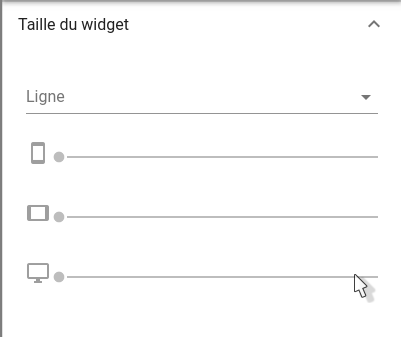

# Météo des services


## Sommaire

### Guide utilisateur
1. [Présentation générale](#presentation-generale)
2. [Les tuiles](#les-tuiles)
3. [La fenêtre 'Plus d'infos'](#la-fenetre-plus-dinfos)
4. [Les détails d'une entité d'un service](#les-details-dune-entite-dun-service)

### Guide exploitant
1. [Paramètres du widget](#parametres-du-widget)

## Guide utilisateur
### Présentation générale
### Les tuiles

La météo de services est composée de tuiles.

Exemple d'une tuile : 

Chaque tuile correspond à un observateur.

Le contenu de texte de cette tuile est personnalisable (*Cf: [Guide exploitant](#guide-exploitant_1)*). Il permet de présenter des informations sur l'observateur.

La couleur de la tuile, ainsi que l'icône présent sur celle-ci permettent d'obtenir des informations sur **l'état** de l'observateur:

### 1. La couleur

La couleur de la tuile correspond à l'état de l'observateur. Cet état est calculé en prenant en compte le pire état parmis les entités surveillées par cet observateur.

Exemple : 
Un observateur surveille deux entités, A et B. A a un état de 1. B a un état de 3. L'état de l'observateur sera alors égal à 3.

- Vert : Etat = 0 => Ok
- Jaune : Etat = 1 => Mineur
- Orange : Etat = 2 => Majeur
- Rouge : Etat = 3 => Critique
- Gris : 

### 2. L'icone

- Soleil
- Soleil + Nuage
- Nuage
- Pluie
- Clé
- Lune
- Pause

### La fenêtre 'Plus d'infos'
### Les détails d'une entité d'un service

## Guide exploitant
### Paramètres du widget
1. Taille du widget
2. Titre
3. Editeur de filtre
4. Paramètres avancés
  1. Template - Tuiles
  2. Template - Modal
  3. Template - Entités
  4. Colonnes - Petit
  5. Colonnes - Moyen
  6. Colonnes - Large

#### Taille du widget (*requis*)

Ce paramètre permet de régler la taille du widget.



La première information à renseigner est la ligne dans laquelle le widget doit apparaitre. Ce champ permet de rechercher parmis les lignes disponibles. Si aucune ligne n'est disponible, ou pour en créer une nouvelle, entrez son nom, puis appuyez sur la touche Entrée.

Ensuite, les 3 champs en dessous permettent de définir respectivement la largeur occupée par le widget sur mobile, tablette, de ordinateur de bureau.
La largeur maximale est de 12 colonnes pour un widget, la largeur minimale est de 3 colonnes.

#### Titre (*optionnel*)

Ce paramètre permet de définir le titre du widget, qui sera affiché au dessus de celui-ci.

Un champ de texte vous permet de définir ce titre.

#### Editeur de filtre (*optionnel*)

Ce paramètre permet de définir le filtre à appliquer à la météo de services.
Ce filtre permet de n'afficher qu'une partie des observateurs.
Pour plus de détails sur les filtres et leur création, voir la partie sur [Les filtres](../../filtres/index.md).

Pour créer un filtre, ou éditer celui actuellement actif, cliquez sur le bouton 'Créer/Editer'. Une fenêtre de création de filtre s'ouvre alors.

Pour supprimer le filtre actuellement actif, cliquez sur l'icone de suppression se trouvant à droite du bouton 'Créer/Editer'. Une fenêtre vous demande alors de confirmer la suppression.

#### Paramètres avancés
##### Template - Tuile

Ce paramètre permet de personaliser les informations affichées à l'intérieur des tuiles de la météo de service.

Le langage utilisé ici est le Handlebars.

Cliquez sur le bouton 'Afficher/Editer'. Une fenêtre s'ouvre avec un éditeur de texte. Entre le texte souhaité pour le template des tuiles, puis cliquez sur 'Envoyer'.

Une variable est disponible ici pour vous permettre d'affiché les détails de l'observateur : ```watcher```.
Exemple : Pour afficher le champs 'display_name' de l'observateur (qui correspond au nom de l'observateur), il vous faut écrire dans le template : ```{{ watcher.display_name }}```.
Tout les champs disponibles dans l'observateurs sont disponibles ici.

##### Template - Modal

Ce paramètre permet de personnaliser les informations affichées en haut de la fenêtre 'Plus d'infos' (ouverte au clique sur 'Plus d'infos', sur une des tuiles de la météo de services).

Celui-ci fonctionne de la même manière que le paramètre Template - Tuile présenté ci-dessus. Cliquez [ici](#template-tuile) pour vous rendre à cette partie.

##### Template - Entités

Ce paramètre permet de personnaliser les informations affichées pour chaque entités dans la fenêtre 'Plus d'infos' (ouverte au clique sur 'Plus d'infos', sur une des tuiles de la météo de services).

Le langage utilisé ici est le Handlebars.

Cliquez sur le bouton 'Afficher/Editer'. Une fenêtre s'ouvre avec un éditeur de texte. Entre le texte souhaité pour le template des tuiles, puis cliquez sur 'Envoyer'.

Une variable est disponible ici pour vous permettre d'affiché les détails de l'entité : ```entity```.
Exemple : Pour afficher le champs 'name' de l'entité (qui correspond au nom de l'entité), il vous faut écrire dans le template : ```{{ entity.name }}```.
Tout les champs disponibles dans l'entité sont disponibles ici.

##### Colonnes - Petit

Ce paramètre permet de définir la proportion de l'écran, en largeur, prise par chaque tuile de la météo de services. Ce paramètre concerne les écrans de mobiles (largeur < 450px). Une tuile occupe au minimum une colonne (1/12 de la largeur de la page), et au maximum 12 colonnes (100 % de la largeur de la page).

Il suffit de faire glisser le curseur pour sélectionner le nombre de colonne par tuile souhaité.

##### Colonnes - Moyen

Ce paramètre permet de définir la proportion de l'écran, en largeur, prise par chaque tuile de la météo de services. Ce paramètre concerne les écrans de tablettes (largeur < 900px). Une tuile occupe au minimum une colonne (1/12 de la largeur de la page), et au maximum 12 colonnes (100 % de la largeur de la page).

Il suffit de faire glisser le curseur pour sélectionner le nombre de colonne par tuile souhaité.

##### Colonnes - Large

Ce paramètre permet de définir la proportion de l'écran, en largeur, prise par chaque tuile de la météo de services. Ce paramètre concerne les écrans d'ordinateurs (largeur > 900px). Une tuile occupe au minimum une colonne (1/12 de la largeur de la page), et au maximum 12 colonnes (100 % de la largeur de la page).

Il suffit de faire glisser le curseur pour sélectionner le nombre de colonne par tuile souhaité.
