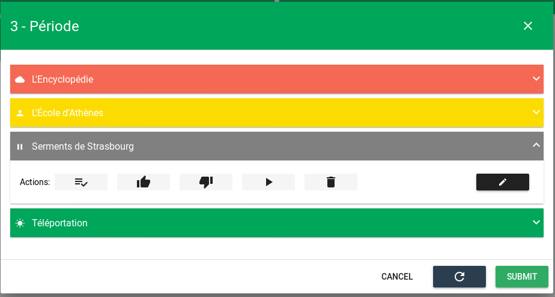
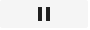

# Météo des services


## Sommaire

### Guide utilisateur
1. [Présentation générale](#presentation-generale)
2. [Les tuiles](#les-tuiles)
3. [La modale](#la-modale)

### Guide exploitant
1. [Aide sur les variables](#aide-variables)
2. [Paramètres du widget](#parametres-du-widget)

## Guide utilisateur
### Présentation générale
### Les tuiles

La météo de services est composée de tuiles.

Exemple d'une tuile : 

Chaque tuile correspond à un observateur.

Le contenu de texte de cette tuile est personnalisable (*Cf: [Guide exploitant](#guide-exploitant_1)*). Il permet de présenter des informations sur l'observateur.

La couleur de la tuile et l'icône présente sur celle-ci permettent d'obtenir des informations sur **l'état** de l'observateur:

#### La couleur

La couleur de la tuile correspond à l'état de l'observateur. Cet état est calculé en prenant en compte le pire état parmi les entités surveillées par cet observateur.

Exemple :
Un observateur surveille deux entités, A et B. A a un état de 1. B a un état de 3. L'état de l'observateur sera alors égal à 3.

- Vert: Etat = 0 => Ok
- Jaune: Etat = 1 => Mineur
- Orange: Etat = 2 => Majeur
- Rouge: Etat = 3 => Critique
- Gris: L'observateur (ou toutes les entités de l'observateur) possède un comportement périodique actif (pause, maintenance, ...).

#### L'icone

- Soleil: L'observateur possède un état "Ok" (égal à 0)
- Personne: L'observateur possède un état Mineur (égal à 1) ou Majeur (égal à 2)
- Nuage: L'observateur possède un état: "Critique" (égal à 3)
- Clé: L'observateur possède un comportement périodique actif, de type "Maintenance"
- Lune: L'observateur possède un comportement périodique actif, de type "Hors plage de surveillance"
- Pause: L'observateur ne possède pas de comportement périodique, mais toutes les entités liées à cet observateur possèdent un comportement périodique actif.

#### Le clignotement

Une tuile de la météo de service clignotera si une des entités lui appartenant possède une alarme non acquittée, et que celui-ci n'est pas en pause/ne possède pas d'entité en pause.

### La modale

Au clic sur une tuile de la météo de services, une fenêtre s'ouvre.

Le contenu de cette fenêtre est configurable depuis les paramètres du widget.

Celle-ci contient, au choix :

- "Plus d'infos": Cette fenêtre présente des informations supplémentaires concernant l'observateur sur lequel vous avez cliqué. Celle-ci peut, notamment, contenir la liste des entités concernées par l'observateur. Le template de cette fenêtre est configurable depuis les paramètres du widget.



- "Bac à alarmes": Cette fenêtre contient un widget Bac à alarmes. Ce Bac à alarmes regroupe toutes les alarmes dans le spectre de l'observateur. Celui-ci est configurable depuis les paramètres du widget.


### Les actions

Dans [la modale "Plus d'infos"](#la-modale), il vous est possible d'afficher la liste des entités concernées par l'observateur (*Cf: [Template - modale](#template-modale)*).

Si la liste d'entités est affichée, des actions sont disponibles sur chacune d'entre elles. Les actions disponibles dépendent de l'état de l'entité.

Au clic sur les icônes d'actions, celles-ci sont mises en attente. Elles ne sont exécutées qu'au clic sur le bouton ```Envoyer``` de la modale "Plus d'infos".

-  *Déclarer un incident*: Cette action vous permet de déclarer un numéro de ticket, associé à un incident. Au clic sur cette action, une fenêtre s'ouvre, vous permettant d'indiquer un numéro de ticket. Cette action déclenche également automatiquement une action d'acquittement.
-  *Pause*: Cette action vous permet de mettre une entité en pause. Au clic, une fenêtre s'ouvre. Celle-ci vous permet de renseigner un commentaire, ainsi que la raison de la pause. Cette action n'est disponible que pour les entités qui ne sont pas déjà en pause.
-  *Play*: Cette action vous permet de modifier tout les comportements périodiques de type `Pause`. La date de fin de ces comportements périodiques est modifiée pour passer à la date actuelle, ce qui met de fait fin à la pause. Cette action n'est disponible que pour les entités en pause.
-  *Acquittement*: Cette action vous permet d'acquitter une alarme présente sur une entité. Cette action n'est disponible que pour les entités ayant un état différent de "Ok" (0), et ayant une alarme non acquittée.
-  *Valider*: Cette action déclenche un changement d'état de l'alarme, de majeur (2) à critique (3). Elle entraîne également automatiquement une action d'acquittement. Celle-ci n'est disponible que pour les entités ayant un état majeur (2).
-  *Invalider*: Cette action déclenche une action d'annulation de l'alarme. Elle entraîne également automatiquement une action d'acquittement. Celle-ci n'est disponible que pour les entités ayant un état majeur (2).

## Guide exploitant

### Aide - Variables

Durant la configuration de votre widget Météo de services, notamment les Templates, il vous sera possible d'accéder à des variables concernant les observateurs.

Exemple: Il vous sera possible d'afficher, pour chacune des tuiles de la météo de services, le nom de l'observateur, ou son identifiant, etc.

Afin de connaitre les variables disponibles, une modale d'aide est disponible.

Pour y accéder, entrez dans le mode d'édition (*Cf: [Vues - Mode d'édition](../../vues#mode-edition)*).

Un bouton d'aide apparaît alors sur chacune des tuiles de la Météo de service.

Au clic sur ce bouton, une fenêtre s'ouvre. Celle-ci liste toutes les variables disponibles dans vos différents templates. Un bouton, à droite de chacune des variables, vous permet de copier directement dans le Presse-papier le chemin de cette variable.

### Paramètres du widget
1. Taille du widget
2. Titre
3. Editeur de filtre
4. Paramètres avancés
    1. Template - Tuiles
    2. Template - modale
    3. Template - Entités
    4. Colonnes - Petit
    5. Colonnes - Moyen
    6. Colonnes - Large
    7. Marges
    8. Hauteur
    9. Type de modale

#### Taille du widget (*requis*)

Ce paramètre permet de régler la taille du widget.


La première information à renseigner est la ligne dans laquelle le widget doit apparaitre. Ce champ permet de rechercher parmi les lignes disponibles. Si aucune ligne n'est disponible, ou pour en créer une nouvelle, entrez son nom, puis appuyez sur la touche Entrée.

Ensuite, les 3 champs en dessous permettent de définir respectivement la largeur occupée par le widget sur mobile, tablette, de ordinateur de bureau.
La largeur maximale est de 12 colonnes pour un widget, la largeur minimale est de 3 colonnes.

#### Titre (*optionnel*)

Ce paramètre permet de définir le titre du widget, qui sera affiché au dessus de celui-ci.

Un champ de texte vous permet de définir ce titre.

#### Editeur de filtre (*optionnel*)

Ce paramètre permet de définir le filtre à appliquer à la météo de services.
Ce filtre permet de n'afficher qu'une partie des observateurs.
Pour plus de détails sur les filtres et leur création, voir la partie sur [Les filtres](../../filtres/index.md).

Pour créer un filtre, ou éditer celui actuellement actif, cliquez sur le bouton 'Créer/Editer'. Une fenêtre de création de filtre s'ouvre alors.

Pour supprimer le filtre actuellement actif, cliquez sur l'icone de suppression se trouvant à droite du bouton 'Créer/Editer'. Une fenêtre vous demande alors de confirmer la suppression.

!!! warning "Champs utilisables dans le filtre"
    Le filtre utilise les champs des entités (qui sont différents des champs utilisables dans les templates). Par exemple, pour filtrer sur le nom d'un watcher, il faut utiliser `name`, et non `display_name`.

#### Paramètres avancés
##### Template - Tuile

Ce paramètre permet de personaliser les informations affichées à l'intérieur des tuiles de la météo de service.

Le langage utilisé ici est le Handlebars.

Cliquez sur le bouton 'Afficher/Editer'. Une fenêtre s'ouvre avec un éditeur de texte. Entre le texte souhaité pour le template des tuiles, puis cliquez sur 'Envoyer'.

Une variable est disponible ici pour vous permettre d'afficher les détails de l'observateur : `entity`.
Exemple : Pour afficher le champ `display_name` de l'observateur (qui correspond au nom de l'observateur), il vous faut écrire dans le template : `{{ entity.display_name }}`.
Tous les champs disponibles dans l'observateur sont disponibles ici.

##### Template - Modale

Ce paramètre permet de personnaliser les informations affichées dans la fenêtre 'Plus d'infos' (ouverte au clic sur 'Plus d'infos', sur une des tuiles de la météo de services).

Il vous est possible ici d'afficher, à n'importe quel endroit de la modale, la liste des entités concernées par l'observateur sur lequel vous avez cliqué. Pour ce faire, insérez dans le template:

```
{{ entities }}
```

Cela aura pour effet d'insérer dans la modale la liste des entités. Par défaut, le nom de l'entité sera affiché pour chacune d'entre elles. Il vous est possible de modifier la valeur affichée ici. Tous les champs de l'entité sont disponibles. Pour ce faire, ajoutez un argument ```name``` à la balise précédemment ajoutée. Il vous est donc possible d'écrire, par exemple :

```
{{ entities name="entity.entity_id" }}
```

Pour chaque entité de la liste, l'id de l'entité sera affiché, à la place de son nom.

On peut également entrer :

```
{{ entities name="entity.infos.customer.value" }}
```

Pour chaque entité de la liste, la valeur de leur champ enrichi customer sera affiché, à la place du nom.

Celui-ci fonctionne de la même manière que le paramètre Template - Tuile présenté ci-dessus. Cliquez [ici](#template-tuile) pour vous rendre à cette partie.

##### Template - Entités

Ce paramètre permet de personnaliser les informations affichées pour chaque entités dans la fenêtre 'Plus d'infos' (ouverte au clic sur 'Plus d'infos', sur une des tuiles de la météo de services).

**Attention: La liste des entités n'est affichée que si cela a été précisé dans le [Template - Modale](#template-modale).**

Le langage utilisé ici est le Handlebars.

Cliquez sur le bouton 'Afficher/Editer'. Une fenêtre s'ouvre avec un éditeur de texte. Entre le texte souhaité pour le template des tuiles, puis cliquez sur 'Envoyer'.

Une variable est disponible ici pour vous permettre d'afficher les détails de l'entité : `entity`.
Exemple : Pour afficher le champ 'name' de l'entité (qui correspond au nom de l'entité), il vous faut écrire dans le template : `{{ entity.name }}`.
Tous les champs disponibles dans l'entité sont disponibles ici.

##### Colonnes - Petit

Ce paramètre permet de définir la proportion de l'écran, en largeur, prise par chaque tuile de la météo de services. Ce paramètre concerne les écrans de mobiles (largeur < 450px). Une tuile occupe au minimum une colonne (1/12 de la largeur de la page), et au maximum 12 colonnes (100 % de la largeur de la page).

Il suffit de faire glisser le curseur pour sélectionner le nombre de colonne par tuile souhaité.

##### Colonnes - Moyen

Ce paramètre permet de définir la proportion de l'écran, en largeur, prise par chaque tuile de la météo de services. Ce paramètre concerne les écrans de tablettes (largeur < 900px). Une tuile occupe au minimum une colonne (1/12 de la largeur de la page), et au maximum 12 colonnes (100 % de la largeur de la page).

Il suffit de faire glisser le curseur pour sélectionner le nombre de colonne par tuile souhaité.

##### Colonnes - Large

Ce paramètre permet de définir la proportion de l'écran, en largeur, prise par chaque tuile de la météo de services. Ce paramètre concerne les écrans d'ordinateurs (largeur > 900px). Une tuile occupe au minimum une colonne (1/12 de la largeur de la page), et au maximum 12 colonnes (100 % de la largeur de la page).

Il suffit de faire glisser le curseur pour sélectionner le nombre de colonne par tuile souhaité.

##### Marges

Ce paramètre permet de régler les espaces séparant les tuiles de la Météo de services.

Celui-ci est séparé en quatre, vous permettant de régler l'espace que vous souhaitez pour chaque côté des tuiles (haut, bas, droite et gauche).

Pour modifier ce paramètre, faites glisser le sélecteur, afin de choisir une valeur entre 0 et 5 (0 correspondant à l'absence de marge, 5 le maximum de marge).

Par défaut, ce paramètre est réglé sur une valeur de 1 pour chacuns des côtés des tuiles.

##### Hauteur

Ce paramètre permet de régler la hauteur des tuiles de la Météo de services.

Pour le modifier, faites glisser le sélecteur, afin de choisir une valeur entre 1 (hauteur minimale) et 20 (hauteur maximale).

Par défaut, ce paramètre est réglé sur une valeur de 1.

##### Type de modale

Ce paramètre vous permet de sélectionner le type de modale que vous souhaitez ouvrir au clic sur une tuile de la Météo de services.

Les types de modales disponibles sont :

- "Plus d'infos": Cette modale vous permet d'afficher (grâce à un template configurable) des détails supplémentaires sur l'observateur sur lequel vous cliquez.
- "Bac à alarmes": Cette modale vous permet d'afficher un widget Bac à alarmes, regroupant les alarmes liées à l'observateur. Ce widget est configurable grace aux [Paramètres du bac à alarmes](#parametres-du-bac-a-alarmes).
