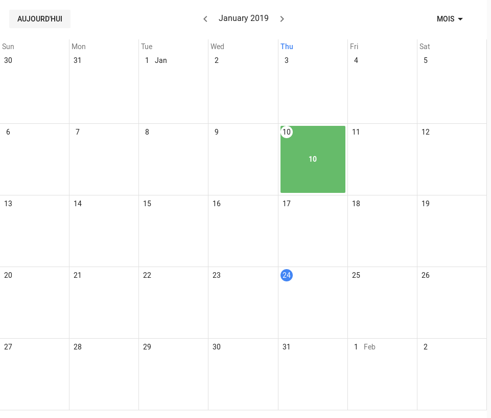
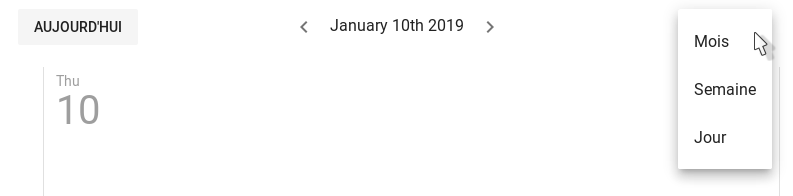
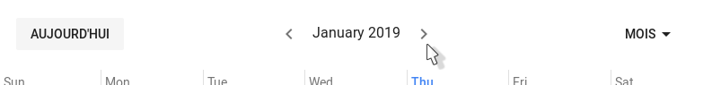
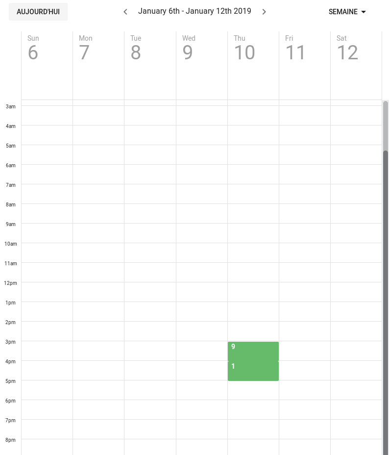
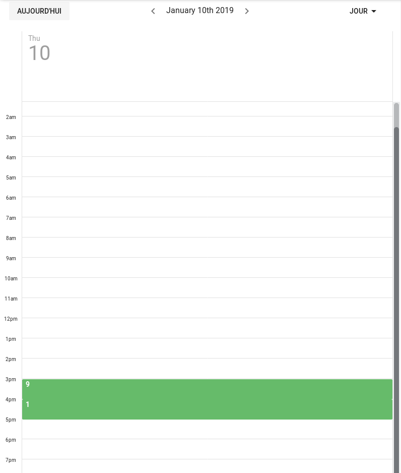
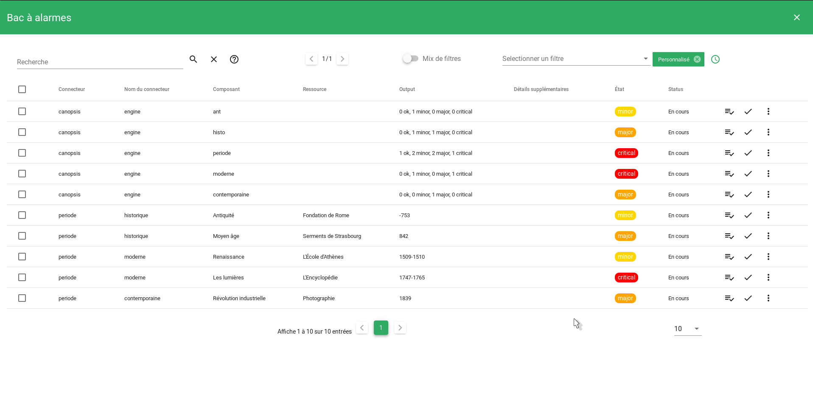

# Calendrier



## Sommaire
### Guide utilisateur

1. [Présentation du widget](#presentation-du-widget)
2. [Le calendrier](#le-calendrier)
3. [Le bac à alarmes](#le-bac-a-alarmes)

### Guide exploitant

1. [Paramètres du widget](#parametres-du-widget)

## Guide utilisateur

### Présentation du widget

Le widget Calendrier vous permet d'afficher le nombre d'alarmes créées/résolues, dans un format de calendrier.

Il vous est donc possible de :

- Visionner le nombre d'alarmes créées/résolues chaques jours.
- Regrouper ces alarmes par groupes, représentants une partie de votre SI.
- Affecter des seuils de criticité, associés à des couleurs, vous permettant de repérer d'un seul coup d'oeil les mois/jours/heures où se sont produits des incidents.
- Accéder directement à un Bac à alarmes, regroupant les alarmes de la période.

### Le calendrier

Par défaut, la vue affichée est la vue au mois. Sur cette vue, chaque journée est représentée par une case du calendrier.

D'autres vues sont disponibles : à la semaine et au jour.

Pour changer de vue, cliquez sur le menu déroulant situé en haut à droite du widget, puis cliquez sur la vue souhaitée.



Pour chacune des vue, la période concernée est affichée en haut du widget. Des flèches permettent de passer à la période précédente/suivante.



En haut à gauche, un bouton ```Aujourd'hui``` vous permet de vous rendre directement à la période actuelle.

Dans les vues "semaine" et "jour", les alarmes sont affichées selon leur heure de création.

**Vue à la semaine**



**Vue à la journée**



### Le bac à alarmes

Au clic sur une des valeurs affichées dans le calendrier, une fenêtre s'ouvre.

Celle-ci présente un widget Bac à alarmes, vous permettant de visualiser les alarmes de la période sur laquelle vous avez cliquer (la journée, l'heure, ...).

Ce bac à alarme est paramétrable depuis le panneau de configuration du widget Calendrier (voir [Paramétres du Bac à alarmes](#parametres-du-bac-a-alarmes)).



## Guide exploitant

### Paramètres du widget

1. Taille du widget (*requis*)
2. Titre (*optionnel*)
3. Paramètres du Bac à alarmes (*optionnel*)
    1. Nom des colonnes
    2. Nombre d'élements/page par défaut
    3. Info popup
    4. Fenêtre "Plus d'infos"
4. Paramètres avancés
    1. Filtres
    2. Filtre sur Open/Resolved
    3. Prendre en compte les comportements périodiques
    4. Niveaux de criticité
    5. Sélecteur de couleurs
  
#### Taille du widget (*requis*)

Ce paramètre permet de régler la taille du widget.


La première information à renseigner est la ligne dans laquelle le widget doit apparaître. Ce champ permet de rechercher parmi les lignes disponibles. Si aucune ligne n'est disponible, ou pour en créer une nouvelle, entrez son nom, puis appuyez sur la touche Entrée.

Ensuite, les 3 champs en dessous permettent de définir respectivement la largeur occupée par le widget sur mobile, tablette, de ordinateur de bureau.
La largeur maximale est de 12 colonnes pour un widget, la largeur minimale est de 3 colonnes.

#### Titre (*optionnel*)

Ce paramètre permet de définir le titre du widget, qui sera affiché au dessus de celui-ci.

Un champ de texte vous permet de définir ce titre.

#### Paramètres du Bac à alarmes

##### Nom des colonnes

Ce paramètre est détaillé [ici](../../bac-a-alarmes#nom-des-colonnes).

##### Nombre d'éléments/page par défaut

Ce paramètre est détaillé [ici](../../bac-a-alarmes#nombre-delements-par-page-par-defaut).

##### Info popup

Ce paramètre est détaillé [ici](../../bac-a-alarmes#info-popup).

##### Fenêtre "Plus d'infos"

Ce paramètre est détaillé [ici](../../bac-a-alarmes#fenetre-plus-dinfos).

#### Paramètres avancés

##### Filtres (*optionnel*)

Ce paramètre permet de définir le/les filtre(s) à appliquer.

Si aucun filtre n'est appliqué, toutes les alarmes sont prises en compte.

Si un seul filtre est défini, les alarmes affichés ne concernent que les entités entrant dans les critères de celui-ci.

Si plusieurs filtres sont définis, les valeurs seront affichées pour chacun de ces filtres, à côté du nom de celui-ci.

Pour ajouter un filtre, cliquez sur le boutton ```Ajouter```. Une fenêtre de création de filtre s'ouvre. Pour plus de détails sur les filtres, et l'édition de filtres, cliquez [ici](../../../filtres).

Les filtres appliqués apparaissent en dessous du boutton ```Ajouter```. Chacun dispose d'un boutton d'édition, et de suppression.

##### Filtre sur Open/Resolved (*requis*)

Ce paramètre permet de ne prendre en compte, dans les valeurs ne nombre d'alarmes affichées dans le calendrier, que les alarmes ouvertes, résolues, ou les deux.

Cocher la/les cases correspondantes au(x) statu(s) que vous souhaitez prendre en compte.

Par défaut, seul les alarmes ouvertes sont prises en compte.

##### Prendre en compte les comportements périodiques ? (*requis*)

Ce paramètre permet, s'il est activé, de ne pas prendre en compte les alarmes concernant une entité ayant un comportement périodique actif.

Cela permet d'exclure des valeurs affichées les alarmes concernant, par exemple, une entité en maintenance.

Ce paramètre est désactivé par défaut.

##### Niveaux de criticité (*requis*)

Ce paramètre permet de configurer à partir de quelle valeur la valeur d'une statistique est considérée comme mineur/majeure ou critique.

Le niveau de criticité permet de modifier, combinée au paramètre [sélecteur de couleurs](#selecteur-de-couleurs-requis), la couleur à afficher pour la statistique, en fonction de sa valeur.

Les valeurs par défaut sont :

- Ok: Entre 0 et 20
- Mineur: Entre 20 et 30
- Majeur: Entre 30 et 40
- Critique: Supérieur à 40

##### Sélecteur de couleurs (*requis*)

Ce paramètre permet d'affecter une couleur à chaque [niveau de criticité](#niveaux-de-criticite-requis).

Cela permet, d'un seul coup d'oeil, d'identifier les valeurs selon leur niveau de criticité.

Pour modifier une des couleurs définies par défaut, cliquez sur le bouton correspondant à un niveau de criticité. Une fenêtre s'ouvre, vous donnant accès à plusieurs méthodes de choix de la couleur.

Une fois la couleur sélectionnée, cliquez sur ```Envoyer```.
Votre couleur apparaît maintenant dans le menu de paramètres du widget !
