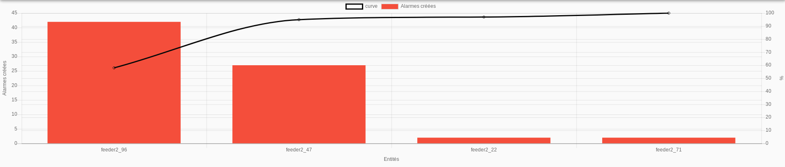

# Diagramme de Pareto



## Sommaire
### Guide utilisateur 

1. [Présentation du widget](#presentation-du-widget)

### Guide exploitant

1. [Paramètres du widget](#parametres-du-widget)

## Guide utilisateur

### Présentation du widget

Le diagramme de Pareto permet de mettre en évidence les entités à l'origine du plus grand nombre d'événements,
par rapport au nombre total.

Ce diagramme se présente sous la forme d'un histogramme listant les entités, avec le nombre d'événements de ces entités. 
Une courbe est présente par dessus cet histogramme, indiquant le cumul, en pourcentage par rapport au nombre total d'événements.

Dans le contexte de Canopsis, cela permet, par exemple, de visualiser les entités à l'origine du plus grand 
nombre d'alarmes crées, ainsi que le cumul du pourcentage par rapport au nombre total d'alarmes crées.

## Guide exploitant

### Paramètres du widget

1. Taille du widget (*requis*)
2. Titre (*optionnel*)
3. Interval de date (*requis*)
4. Filtre (*optionnel*)
5. Sélecteur de statistique (*requis*)
6. Couleurs des statistiques (*optionnel*)

#### Taille du widget (*requis*)

Ce paramètre permet de régler la taille du widget.


La première information à renseigner est la ligne dans laquelle le widget doit apparaître. Ce champ permet de rechercher parmi les lignes disponibles. Si aucune ligne n'est disponible, ou pour en créer une nouvelle, entrez son nom, puis appuyez sur la touche Entrée.

Ensuite, les 3 champs en dessous permettent de définir respectivement la largeur occupée par le widget sur mobile, tablette, de ordinateur de bureau.
La largeur maximale est de 12 colonnes pour un widget, la largeur minimale est de 3 colonnes.

#### Titre (*optionnel*)

Ce paramètre permet de définir le titre du widget, qui sera affiché au dessus de celui-ci.

Un champ de texte vous permet de définir ce titre.

#### Interval de date (*requis*)

Ce paramètre permet de définir l'interval de dates pour lequel les statistiques doivent être affichées.

Par défaut l'interval correspond à "ce mois jusqu'à maintenant".

##### Période

Les deux champs de période correspondent à l'interval entre deux valeurs des statistiques. Sur la courbe, cela se traduira par le temps écoulé entre deux points de calcul des statistiques.

**Pour éviter un temps d'affichage des statistiques trop long, il convient de sélectionner une période suffisament grande, comparée à l'interval choisie**

Exemple: Pour une interval correspondant à une année entière, le temps d'affichage des statistiques heure par heure se verra considérablement augmenté. Alors que l'affichage des statistiques mois par mois prendra, lui, un temps beaucoup plus raisonnable.

##### Interval

Deux sélecteurs permettent ici de sélectionner une date de début, ainsi qu'une date de fin de calcul des statistiques. Le troisième champ (à droite) permet, lui, de sélectionner un interval parmis ceux prédéfinis.

A l'intérieur des champs de sélection de date (gauche), il est possible :

- De sélectionner une date fixe, en cliquant sur l'icone de calendrier, puis en sélectionnant la date voulue
- De sélectionner une date 'dynamique'

###### Langage de sélection de date dynamique

- Le champ doit toujours commencer par le mot clé 'now', faisant référence à la date actuelle
- Ce mot clé now peut être suivi directement de modificateurs. Ces modificateurs sont de la forme :

    * Opérateur: '+' ou '-'
    * Valeur: Nombre d'unités à ajouter/soustraire
    * Unité: 'h' pour 'heures, 'd' pour 'jours', 'm' pour 'mois' et 'y' pour 'année

- A la suite du modificateur peut s'ajouter un opérateur permettant d'arrondir la valeur au début/à la fin de l'unité voulu. Cet opérateur se présente sous la forme: '/unité'. Cet arrondis se fera à la valeur inférieur pour la date de début, à la valeur supérieur pour la date de fin.

Exemples: 

- 'now-7d' -> 'La date d'aujourd'hui moins 7 jours'
- 'now-2m' -> 'La date d'aujourd'hui moins 2 mois'
- 'now-7d/d'

    * Si cette valeur correspond à une date de début -> 'La date d'aujourd'hui moins 7 jours, arrondie au début de la journée'
    * Si cette valeur correspond à une date de fin -> 'La date d'aujourd'hui moins 7 jours, arrondie à la fin de la journée'

##### Intervals prédéfinis

Le champ de droite vous permet de sélectionner parmis un panel d'intervals de dates prédéfinis, afin de ne pas avoir à entrer manuellement l'interval voulu dans les champs de gauche.

#### Filtre (*optionnel*)

Ce paramètre vous permet de définir le filtre à appliquer à la sélection d'entité. Il permet de ne sélectionner que les entités pour lesquels on souhaite afficher les statistiques.

Pour créer un filtre, ou éditer le filtre deja présent, cliquez sur le bouton ```Créer/Editer```.
Pour supprimer le filtre deja existant, cliquez sur le bouton situé à droite du bouton d'édition/création.

Au clic sur le bouton ```Créer/Editer```, une fenêtre d'édition de filtre s'ouvre. Une fois le nom du filtre, et le filtre lui-même renseignés, cliquez sur le bouton ```Envoyer``` pour le sauvegarder.

Pour plus de détails sur les filtres, et l'édition de filtres, cliquez [ici](../../../filtres).

#### Sélecteur de statistique (*requis*)

Ce paramètre permet de définir la statistique à afficher.

Pour modifier la statistique sélectionnée, cliquez sur le bouton ```Sélectionner```.

Une fenêtre s'ouvre.


Cette fenêtre vous permet de définir la statistique souhaitée.

- Statistique à afficher (voir [liste des statstiques disponibles](../index.md#les-statistiques-disponibles)).
- Titre associé à cette statistique.
- Options: Liste d'options concernant la statistique sélectionnée. Les options varient selon la type de statistique voulue :
    - ```Recursif```: Si l'option est activée, permet de calculer la statistique sur l'entité, ainsi que sur ses dépendances, et les dépendances de ses dépendances, etc...
    - ```Etats```: Permet de ne prendre en compte que les alarmes avec le/les état(s) (ok, mineure, majeure ou critique) sélectionné(s).
    - ```Auteurs```: Permet de ne prendre en compte que les alarmes dont le/les auteur(s) fait parti de la liste précisée ici. Pour ajouter un auteur à la liste, entrez son nom, puis appuyer sur la touche "Entrée".
    - ```Sla```: Permet de préciser le temps définit dans le SLA. **Attention: Ce paramètre est requis pour le calcul des statistiques "Taux d'Ack conforme SLA" et "Taux de résolution conforme Sla"**.

Cliquez sur le bouton ```Soumettre``` pour ajouter cette statistique.

#### Couleurs des statistiques (*optionnel*)

Ce paramètre vous permet de définir la couleur que vous souhaitée afficher pour la statistique sélectionnée, ainsi que pour la courbe d'accumulation.

La statistique sélectionnée est affichée avec un bouton ```Sélectionner une couleur```, ainsi que la couleur déjà selectionnée (s'il y en a une).

Pour sélectionner une couleur, cliquez sur le bouton ```Sélectionner une couleur```. Une fenêtre s'affiche. Plusieurs modes de sélection de couleur sont accessibles.

Sélectionnez la couleur souhaitée, puis cliquez sur le boutton ```Envoyer```. La couleur a été sauvegardée.
