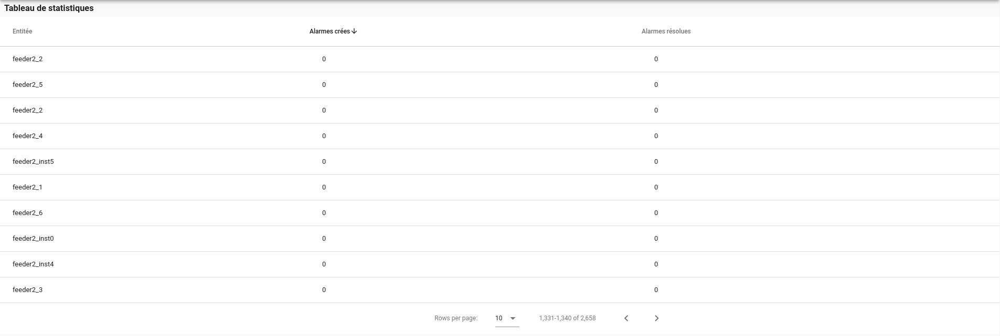
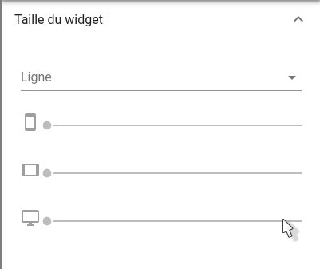
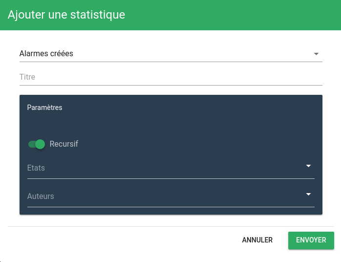
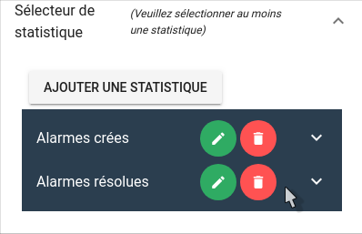

# Tableau de statistiques



## Sommaire
### Guide utilisateur

1. [Présentation du widget](#presentation-du-widget)

### Guide exploitant

1. [Paramètres du widget](#parametres-du-widget)

## Guide utilisateur

### Présentation du widget

Le widget tableau de statistiques se présente sous la forme d'un tableau. Chaque ligne de ce tableau correspond à une entité, et aux statistiques associées à cette entité. La première colonne est non configurable. Celle-ci présente, pour chaque ligne, le nom de l'entité. Chacune des colonnes qui suit correpond à une statistique.

Il est possible, pour chaque valeur de statistique, d'afficher une tendance par rapport à la période précédente.

Le tableau présente entre 1 et n statistiques. Les statistiques affichées sont configurées depuis le panneau de paramètres du widget (voir [paramètres du widget](#parametres-du-widget)).

## Guide exploitant

### Paramètres du widget

1. Taille du widget (*requis*)
2. Titre (*optionnel*)
3. Interval de date (*requis*)
4. Filtre (*optionnel*)
5. Sélecteur de statistique (*requis*)
6. Paramètres avancés
    
    1. Colonne de tri par défaut (*optionnel*)

#### Taille du widget (*requis*)

Ce paramètre permet de régler la taille du widget.



La première information à renseigner est la ligne dans laquelle le widget doit apparaître. Ce champ permet de rechercher parmi les lignes disponibles. Si aucune ligne n'est disponible, ou pour en créer une nouvelle, entrez son nom, puis appuyez sur la touche Entrée.

Ensuite, les 3 champs en dessous permettent de définir respectivement la largeur occupée par le widget sur mobile, tablette, de ordinateur de bureau.
La largeur maximale est de 12 colonnes pour un widget, la largeur minimale est de 3 colonnes.

#### Titre (*optionnel*)

Ce paramètre permet de définir le titre du widget, qui sera affiché au dessus de celui-ci.

Un champ de texte vous permet de définir ce titre.

#### Interval de date (*requis*)

Ce paramètre permet de définir l'interval de dates pour lequel les statistiques doivent être affichées.

Par défaut l'interval correspond à "ce mois jusqu'à maintenant".

##### Période

Le champ de période correspond à l'interval entre deux valeurs des statistiques. Il convient ici de choisir la plus grande période possible, en fonction de l'interval sélectionné en dessous, afin de réduire le temps de chargement des statistiques.

Exemple: 

- Si l'interval sélectionné est 'Dernière année', une période raisonnable serait: 'mois'. 
- Si l'interval sélectionné est 'Aujourd'hui jusqu'à maintenant', une période raisonnable serait: 'heure'.

**Attention**: Si la période sélectionnée est le mois, les dates de début et de fin de calcul des statistiques seront arrondis au premier jour du mois sélectionnée, à 00:00 UTC.

##### Interval

Deux sélecteurs permettent ici de sélectionner une date de début, ainsi qu'une date de fin de calcul des statistiques. Le troisième champ (à droite) permet, lui, de sélectionner un interval parmis ceux prédéfinis.

A l'intérieur des champs de sélection de date (gauche), il est possible :

- De sélectionner une date fixe, en cliquant sur l'icone de calendrier, puis en sélectionnant la date voulue
- De sélectionner une date 'dynamique'

###### Langage de sélection de date dynamique

- Le champ doit toujours commencer par le mot clé 'now', faisant référence à la date actuelle
- Ce mot clé now peut être suivi directement de modificateurs. Ces modificateurs sont de la forme :

    * Opérateur: '+' ou '-'
    * Valeur: Nombre d'unités à ajouter/soustraire
    * Unité: 'h' pour 'heures, 'd' pour 'jours', 'm' pour 'mois' et 'y' pour 'année

- A la suite du modificateur peut s'ajouter un opérateur permettant d'arrondir la valeur au début/à la fin de l'unité voulue. Cet opérateur se présente sous la forme: '/unité'. Cet arrondi se fera à la valeur inférieure pour la date de début, à la valeur supérieure pour la date de fin.

Exemples: 

- 'now-7d' -> 'La date d'aujourd'hui moins 7 jours'
- 'now-2m' -> 'La date d'aujourd'hui moins 2 mois'
- 'now-7d/d'

    * Si cette valeur correspond à une date de début -> 'La date d'aujourd'hui moins 7 jours, arrondie au début de la journée'
    * Si cette valeur correspond à une date de fin -> 'La date d'aujourd'hui moins 7 jours, arrondie à la fin de la journée'

##### Intervals prédéfinis

Le champ de droite vous permet de sélectionner parmis un panel d'intervals de dates prédéfinis, afin de ne pas avoir à entrer manuellement l'interval voulu dans les champs de gauche.

#### Filtre (*optionnel*)

Ce paramètre vous permet de définir le filtre à appliquer à la sélection d'entité. Il permet de ne sélectionner que les entités pour lesquels on souhaite afficher les statistiques.

Pour créer un filtre, ou éditer le filtre deja présent, cliquez sur le bouton ```Créer/Editer```.
Pour supprimer le filtre deja existant, cliquez sur le bouton situé à droite du bouton d'édition/création.

Au clic sur le bouton ```Créer/Editer```, une fenêtre d'édition de filtre s'ouvre. Une fois le nom du filtre, et le filtre lui-même renseignés, cliquez sur le bouton ```Envoyer``` pour le sauvegarder.

Pour plus de détails sur les filtres, et l'édition de filtres, cliquez [ici](../../../filtres).

#### Sélecteur de statistiques (*requis*)

Ce paramètre permet de définir les statistiques à afficher dans le tableau. Chaque statistique se verra affecter une colonne du tableau.

**Il est obligatoire d'ajouter au moins une statistique**

Pour ajouter une statistique, cliquez sur le bouton ```Ajouter une statistique```.

Une fenêtre s'ouvre.




Cette fenêtre vous permet de définir la statistique souhaitée.

- Statistique à afficher (voir [liste des statstiques disponibles](../index.md#les-statistiques-disponibles)).
- Titre associé à cette statistique.
- Options: Liste d'options concernant la statistique sélectionnée. Les options varient selon la type de statistique voulue :
    - ```Tendance```: Si l'option est activée, permet d'afficher, à côté des valeurs des statistiques, une tendance par rapport à la période précédente, accompagnée d'un icône afin d'identifier rapidement si la valeur a augmentée/diminuée/stagnée. 
    - ```Récursif```: Si l'option est activée, permet de calculer la statistique sur l'entité, ainsi que sur ses dépendances, et les dépendances de ses dépendances, etc...
    - ```Etats```: Permet de ne prendre en compte que les alarmes avec le/les état(s) (ok, mineure, majeure ou critique) sélectionné(s).
    - ```Auteurs```: Permet de ne prendre en compte que les alarmes dont le/les auteur(s) fait parti de la liste précisée ici. Pour ajouter un auteur à la liste, entrez son nom, puis appuyer sur la touche "Entrée".
    - ```Sla```: Permet de préciser le temps définit dans le SLA. **Attention: Ce paramètre est requis pour le calcul des statistiques "Taux d'Ack conforme SLA" et "Taux de résolution conforme Sla"**.

Cliquez sur le bouton ```Envoyer``` pour ajouter cette statistique.

La liste des statistiques ajoutées au widget est visible depuis le panneau de paramètres du widget. Un bouton vous permet ici d'éditer la statistique, ou de la supprimer de la liste.



#### Paramètres avancés

##### Colonne de tri par défaut

Ce paramètre permet de définir la colonne selon laquelle les valeurs seront triées par défaut.

Deux sélecteurs sont disponibles ici.
Le premier sélecteur vous permet de choisir la colonne selon laquelle le tri sera effectué. L'ensemble des statistiques sélectionnées sont disponibles.
Le deuxième sélecteur permet de choisir le sens de tri. "ASC" pour un tri ascendant, "DESC" pour un tri descendant.
