# Mise en oeuvre

## Introduction

!!! Note
    Disponible à partir de Canopsis 4.0.0

Cette documentation vous permet de mettre en oeuvre une remédiation de bout en bout.  
Comme expliqué en [préambule](./index.md), l'anatomie d'une remédiation suit le schéma ci-après : 

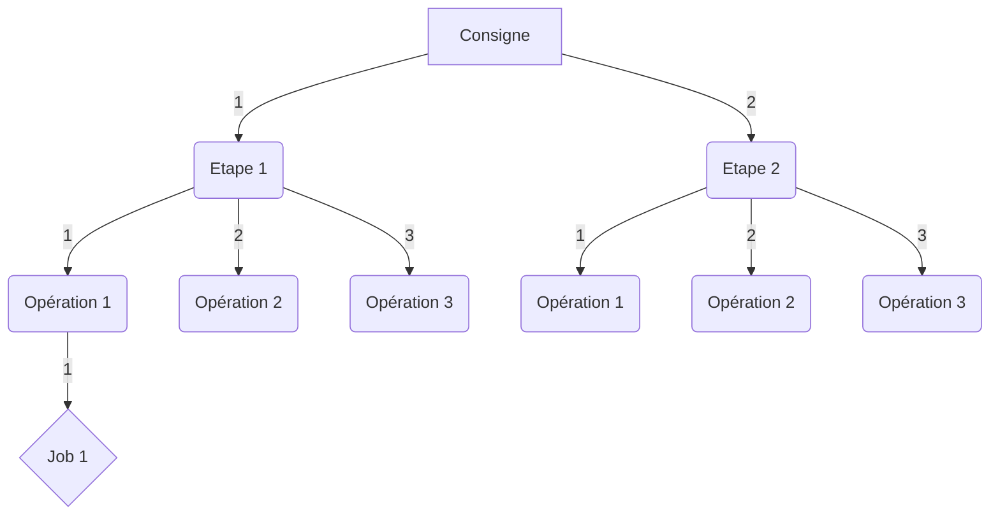

## Les droits

Le module de remédiation est soumis au système de droits sur l'interface et sur les APIs.

**Interface**

Ces droits sont configurés dans le panneau de droits sous l'onglet `technical`

| Droits sur l'interface       | Définition                                         |
|:---------------------------- |:-------------------------------------------------- |
| `Remediation`                | Accès au panneau d'administration des remédiations |
| `Remediation configuration`  | Accès aux configurations d'ordonnanceurs           |
| `Remediation instruction`    | Accès aux consignes                                |
| `Remediation job`            | Accès aux jobs d'ordonnanceurs                     |

**API**

Ces droits sont configurés dans le panneau de droits sous l'onglet `API`

| Droits sur les APIs      | Définition                                          |
|:--------------------- -- |:--------------------------------------------------- |
| `Instructions`           | Manipulation des consignes                          |
| `Runs instructions`      | Exécuter une consigne                               |
| `File`                   | Manipulation des fichiers inclus dans les consignes |
| `Job configs`            | Manipulation des configurations des ordonnanceurs   |
| `Jobs`                   | Manipulation des jobs d'ordonnanceurs               |

## Gestions des consignes

### Créer une consigne

Pour créer une consigne, rendez vous dans le menu d'administration de la remédiation, onglet `CONSIGNES`.  

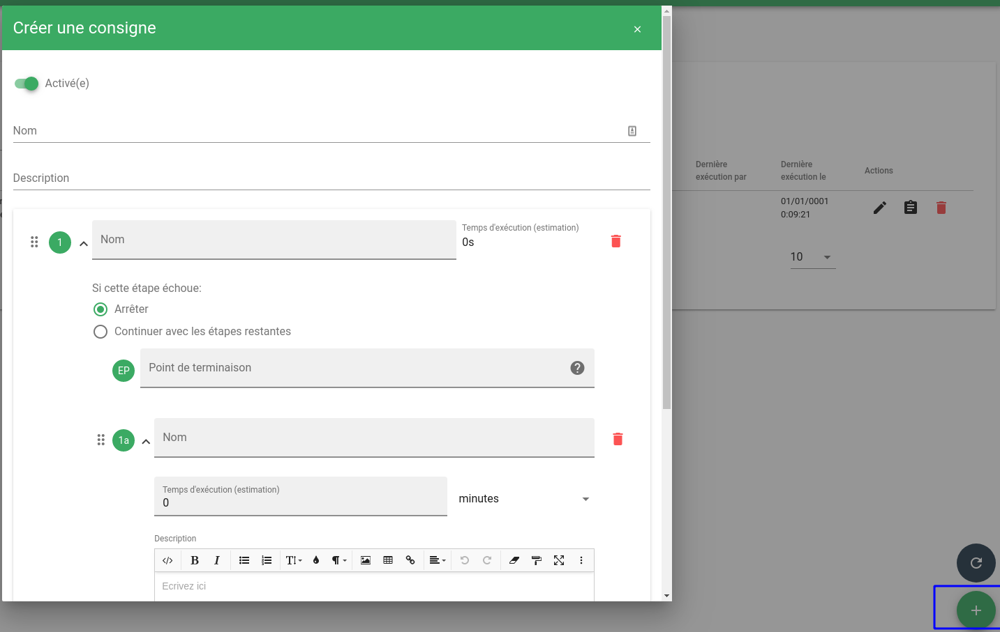

Saisissez à présent les différentes étapes et opérations de votre consigne. Voici un exemple 

**Nom et description de la consigne**

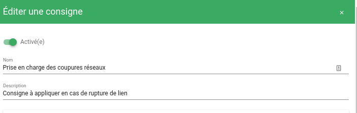

**Etape 1**

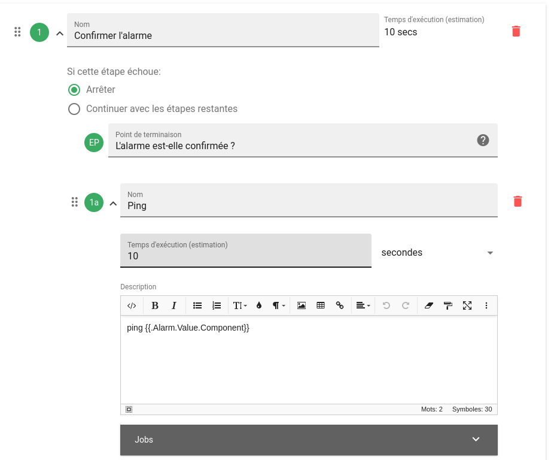

**Etape 2**

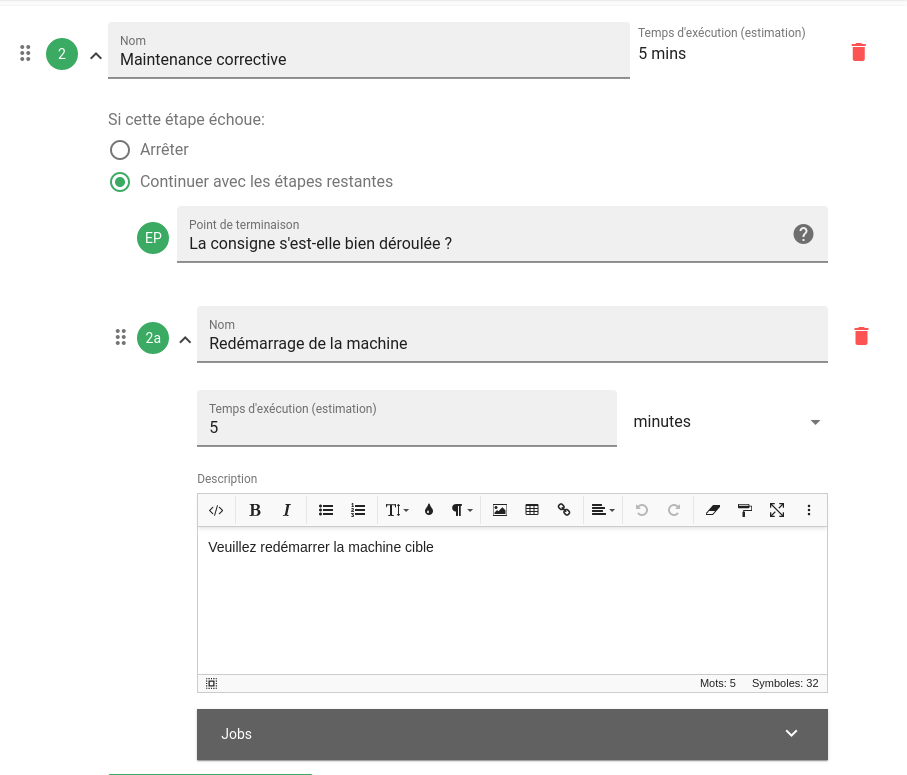

!!! Note
    Veuillez noter que les templates des opérations peuvent utiliser des [variables de payload](../../../guide-administration/architecture-interne/templates-golang/#templates-pour-payload)

    Ainsi vous disposez principalement des variables `.Alarm` et `.Entity`.

Une fois créée, votre consigne sera affichée dans la liste des consignes.  

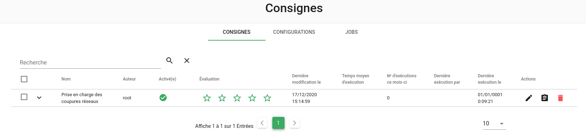

### Assigner une consigne à des alarmes

Lorsque votre consigne a été créée, vous devez l'assigner à une ou des alarmes. 
Pour cela, vous allez pouvoir sélectionner ces alarmes grâce à des patterns spécifiques de l'alarme ou de l'entité associée à l'alarme.
Utilisez pour cela le bouton d'action situé à droite de votre consigne.

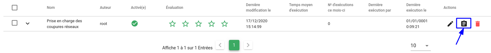

Puis associer vos alarmes en saisissant les patterns souhaités, dans notre cas, les alarmes dont la ressource contient `ping`.

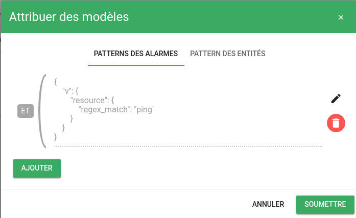

A ce stade, vous pouvez vérifier que les alarmes sélectionnées par les patterns sont bien éligibles à votre consigne.

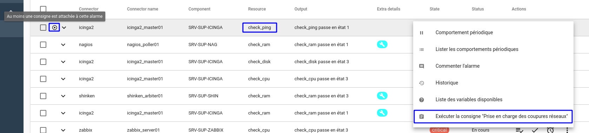

### Associer un job à une opération

!!! Warning
    Pour qu'un job soit disponible, une configuration spécifique est nécessaire. [Consultez ce paragraphe pour cela](#jobs-associes-a-un-ordonnanceur)

Vous avez la possibilité d'associer un job d'ordonnanceur à une opération dans une consigne.

Pour cela, dans votre consigne, il vous suffit de sélectionner le ou les jobs qui seront présentés à l'utilisateur de la consigne pour exécution.

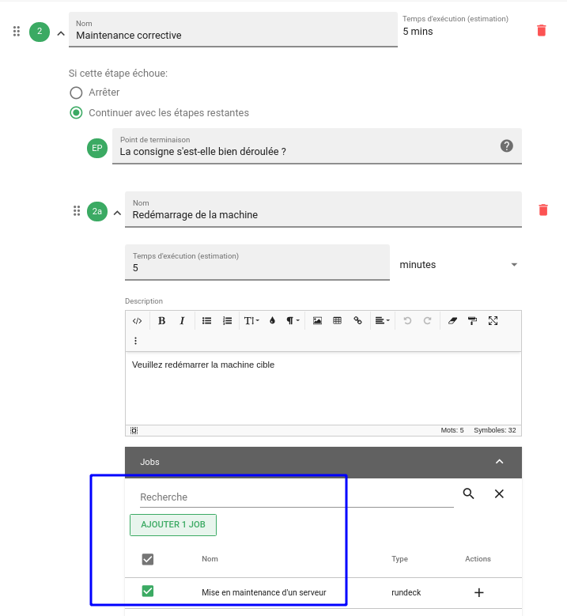

Au moment de l'exécution de la consigne, les jobs associés pourront être exécuter.

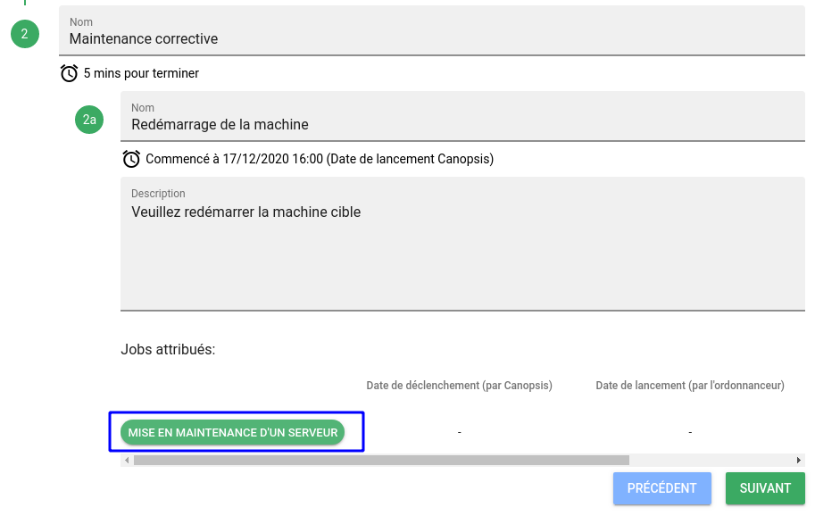

## Jobs associés à un ordonnanceur

Pour être en mesure de relier un job à une opération, il est nécessaire de définir une configuration d'ordonnanceur ainsi que le job en lui-même.  
Pour cela, RDV dans le menu `CONFIGURATIONS` du panneau d'administration des remédiations.  

En cliquant sur le "+" en bas à droite, vous accéderez au formulaire suivant : 

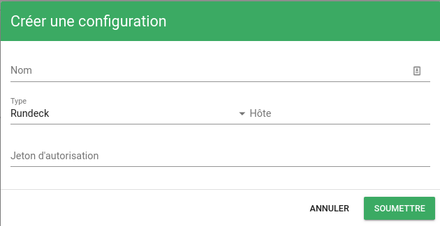

Explications sur les champs demandés :

* Nom : Nom de la configuration qui sera utilisée dans la définition du job
* Type : `Rundeck` ou `Awx` fonction de votre ordonnanceur
* Hôte : Adresse http de votre ordonnanceur
* Jeton d'autorisation : Jeton lié à votre utilisateur déclaré dans l'ordonnanceur

!!! Note
    Vous pouvez consulter [cette page](../../../guide-administration/remediation/) qui concerne les configurations de Rundeck et Awx 

Lorsque la configuration d'ordonnanceur est prête, vous pouvez déclarer un `job`

RDV dans le menu `JOBS` du panneau d'administration des remédiations.

En cliquant sur le "+" en bas à droite, vous accéderez au formulaire suivant : 

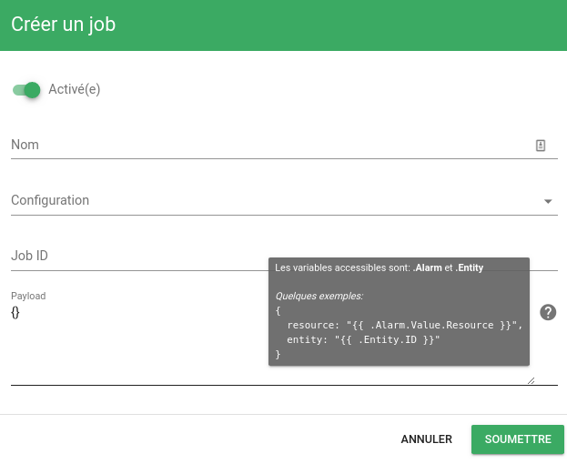

Explications sur les champs demandés :

* Nom : Nom du job qui sera utilisé dans une consigne
* Configuration : Sélection d'une configuration précedemment créée
* Job ID : Identifiant du job donné par l'ordonnanceur
* Payload : Corps du message qui sera transmis à l'ordonnaceur au moment de l'exécution du job

!!! Note
    Vous pouvez consulter [cette page](../../../guide-administration/remediation/) qui concerne les configurations de Rundeck et Awx 

### Payload

Le `payload` ou corps de message associé à un job permet de variabiliser son exécution et ainsi passer des paramètres à l'ordonnanceur de tâches.  
2 objets sont disponibles dans ce payload : 

1. `.Alarm`
2. `.Entity`
