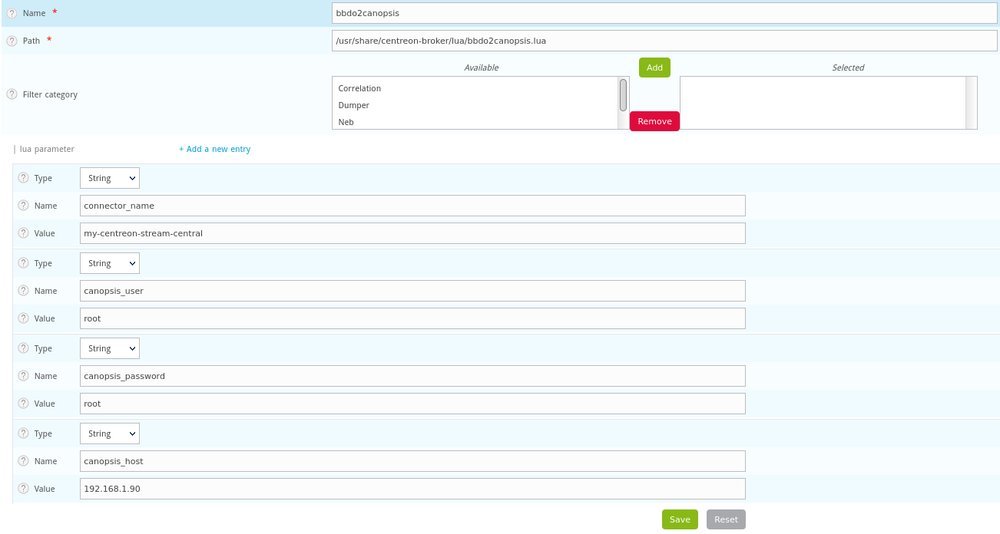

# Connecteur bbdo2canopis.lua "Centreon Stream Connector"

## Description

Cette documentation fait référence au [README][readme] du connecteur.

Le connecteur convertit les évènements envoyés par le Broker Centreon en 
évènements Canopsis.
Ce connecteur utilise les fonctionnalités du Stream Connector de Centreon.

## Principe de fonctionnement

Le connecteur est en langage lua comme imposé par le mécanisme du Stream Connector.
Tous les évènements filtrés par le connecteur sont traduits au format JSON et 
envoyés sur l'**API** Canopsis via le protocole **HTTP**.

### Évènements filtrés

Les évènements de type "NEB" suivants sont actuellement gérés par le connecteur 
et correspondent à une catégorie et un élément du protocole BBDO de Centreon :

- Acquittement ou "Acknowledgment" (category 1, element 1)
- Plages de maintenance ou "Downtime" (category 1, element 5)
- Hôtes ou "Host status" (category 1, element 14)
- Services ou "Service status" (category 1, element 24)

Nous ajoutons des informations "extra" supplémentaires aux évènements hôtes et
services :

- action_url
- notes_url
- servicegroups (pour les services)
- hostgroups (pour les hôtes)

#### Acquittement (ack)

Deux sortes d'actions sont envoyées à Canopsis :

- Création d'un ack
- Suppression d'un ack

L'ack est positionné sur le couple resource/component concerné.

#### Plages de maintenance (downtimes)

Deux sortes d'actions sont envoyées à Canopsis :

- Création d'un downtime
- Annulation d'un downtime

Pour chaque downtime, un identifiant unique est généré afin que l'action 
d'annulation puisse être fonctionnelle en retrouvant le downtime précèdemment
créé.

!!! note
    Les downtimes récurrents ne sont actuellement pas gérés par le connecteur.

#### Hosts

Seuls les évènements de type HARD lors d'un changement d'état sont envoyés à Canopsis.
La traduction des états entre Centreon et Canopsis est la suivante :

```
-- CENTREON // CANOPSIS
-- ---------------------
--       UP    (0) // INFO     (0)
--     DOWN    (1) // CRITICAL (3)
-- UNREACHABLE (2) // MAJOR    (2)
```

#### Services

Seuls les évènements de type HARD lors d'un changement d'état sont envoyés à Canopsis.
La traduction des états entre Centreon et Canopsis est la suivante :

```
-- CENTREON // CANOPSIS
-- ---------------------
--       OK (0) // INFO     (0)
--  WARNING (1) // MINOR    (1)
-- CRITICAL (2) // CRITICAL (3)
-- UNKNOWN  (3) // MAJOR    (2)
```

## Intégration du connecteur

### Prérequis

- lua version >= 5.1.4
- lua-socket library >= 3.0rc1-2
- centreon-broker version 19.10.5 ou >= 20.04.2

### Installation

#### Par les paquets

Uniquement valable pour une version de centreon-broker >= 20.04.2.

**Installation du dépôt Canopsis :**

```
echo "[canopsis]
name = canopsis
baseurl=https://repositories.canopsis.net/pulp/repos/centos7-canopsis/
gpgcheck=0
enabled=1" > /etc/yum.repos.d/canopsis.repo
```

**Installation du paquet :**

```
yum install canopsis-connector-centreon-stream-connector
```

#### Par les sources

Compatible avec la version 19.10.5 et >= 20.04.2 :

0. Récupérer les [sources du connecteur][sources]
1. Copier le script sur le serveur Centreon central dans `/usr/share/centreon-broker/lua/bbdo2canopsis.lua`.
2. Ajouter les permissions suivantes : `chown centreon-engine:centreon-engine /usr/share/centreon-broker/lua/bbdo4canopsis.lua`

#### Activation du connecteur

1. Ajout d'une nouvelle entrée ["Generic - Stream connector"][configure-centreon-broker]
2. Export de la [configuration du poller][configure-centreon-broker]
3. Redémarrage des services `systemctl restart cbd centengine gorgoned`

### Configuration

Toute la configuration du connecteur peut se faire au travers de l'interface
Centreon.

**Voici les principaux paramètres surchargeables :**

```
connector_name         = "Nom du connecteur"
canopsis_user          = "Utilisateur de l'API"
canopsis_password      = "Mot de passer de l'utilisateur"
canopsis_host          = "Hôte Canopsis"
```

**Il est possible de modifier les paramètres de file d'attente par défaut :**

```
max_buffer_age         = 60     -- durée de rétention des évènements avant envoi
max_buffer_size        = 10     -- nombre d'évènements en attente avant envoi
```

**Temps de propagation et convergence des évènements :**

```
init_spread_timer      = 360   -- temps de propagation des évènements au démarrage du connecteur
```

Ce compteur est nécessaire pour que lors de l'activation du connecteur,
un maximum d'évènement en état "HARD" soient transmis à Canopsis même s'il n'y a
pas eu de changement d'état pendant le temps de non activation du connecteur.

Cette fonctionnalité permet de tendre vers une convergence d'informations entre
Centreon et Canopsis.

Cela implique un pic de charge  lors de l'activation du connecteur pendant la
durée du "init_spread_timer".

#### Exemple de configuration

Dans : Configuration > Pollers > Broker configuration > central-broker-master >
Output > Select "Generic - Stream connector" > Add



:warning: n'utilisez pas caractères spéciaux ou même de points "." dans le nom
des variables au risque de rencontrer cette erreur :

```
[1600158738] error:   main: configuration update could not succeed, reloading previous configuration: state applier: endpoint name '.'
 is not valid: allowed characters are ABCDEFGHIJKLMNOPQRSTUVWXYZabcdefghijklmnopqrstuvwxyz0123456789 -_
```

### Contrôle du bon fonctionnement

Connectez-vous l'interface de Canopsis et assurez-vous que les évènements et leurs
états affichés du côté de Centreon correspondent avec les évènements côté Canopsis.

Pour rappel, seules les alarmes sont envoyées (état différent de "ok").

[readme]: https://git.canopsis.net/canopsis-connectors/connector-centreon-stream-connector/-/blob/master/README.md
[sources]: https://git.canopsis.net/canopsis-connectors/connector-centreon-stream-connector
[configure-centreon-broker]: https://docs.centreon.com/current/en/developer/developer-stream-connector.html#configure-centreon-broker
