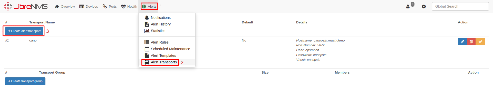
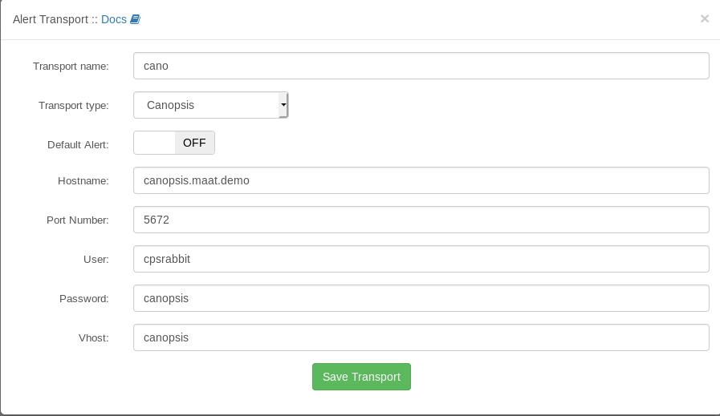
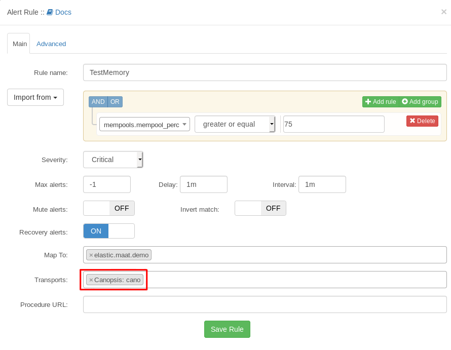

# Connecteur LibreNMS vers Canopsis

## Description

Convertit des évènements de supervision LibreNMS en évènements Canopsis.

## Fonctionnement général

Il est important de noter que ce connecteur n'envoie que des alertes.

Voici le processus complet d'une vérification LibreNMS menant à une alerte :

*  Le poller LibreNMS recueille les données (principalement SNMP) des hôtes.
*  Ces données sont vérifiées par rapport à un ensemble de règles, configurables via l'interface Web ou dans un fichier de configuration.
*  Si une règle correspond, une alerte est ajoutée et prête à être envoyée.
*  LibreNMS envoie, via le script `alerts.php` des alertes sur chaque transport activé configuré.

## Installation et configuration

!!! note
    Le module PHP `bcmath` est nécessaire pour le bon fonctionnement du connecteur.

Le connecteur est installé par défaut lors d'une installation de LibreNMS dans `/opt/librenms/LibreNMS/Alert/Transport/Canopsis.php` :

```php
<?php
namespace LibreNMS\Alert\Transport;
use LibreNMS\Alert\Transport;
class Canopsis extends Transport
{
    public function deliverAlert($obj, $opts)
    {
        if (!empty($this->config)) {
            $opts['host'] = $this->config['canopsis-host'];
            $opts['port'] = $this->config['canopsis-port'];
            $opts['user'] = $this->config['canopsis-user'];
            $opts['pass'] = $this->config['canopsis-pass'];
            $opts['vhost'] = $this->config['canopsis-vhost'];
        }
        return $this->contactCanopsis($obj, $opts);
    }
    public function contactCanopsis($obj, $opts)
    {
        // Configurations
        $host     = $opts["host"];
        $port     = $opts["port"];
        $user     = $opts["user"];
        $pass     = $opts["pass"];
        $vhost    = $opts["vhost"];
        $exchange = "canopsis.events";
        // Connection
        $conn = new \PhpAmqpLib\Connection\AMQPConnection($host, $port, $user, $pass, $vhost);
        $ch   = $conn->channel();
        // Declare exchange (if not exist)
        // exchange_declare($exchange, $type, $passive=false, $durable=false, $auto_delete=true, $internal=false, $nowait=false, $arguments=null, $ticket=null)
        $ch->exchange_declare($exchange, 'topic', false, true, false);
        // Create Canopsis event, see: https://github.com/capensis/canopsis/wiki/Event-specification
        switch ($obj['severity']) {
            case "ok":
                $state = 0;
                break;
            case "warning":
                $state = 2;
                break;
            case "critical":
                $state = 3;
                break;
            default:
                $state = 0;
        }
        $msg_body = array(
            "timestamp" => time(),
            "connector" => "librenms",
            "connector_name" => "LibreNMS1",
            "event_type" => "check",
            "source_type" => "resource",
            "component" => $obj['hostname'],
            "resource" => $obj['name'],
            "state" => $state,
            "output" => $obj['msg'],
            "display_name" => "librenms"
        );
        $msg_raw  = json_encode($msg_body);
        // Build routing key
        if ($msg_body['source_type'] == "resource") {
            $msg_rk = $msg_rk . "." . $msg_body['resource'];
        } else {
            $msg_rk = $msg_body['connector'] . "." . $msg_body['connector_name'] . "." . $msg_body['event_type'] . "." . $msg_body['source_type'] . "." . $msg_body['component'];
        }
        // Publish Event
        $msg = new \PhpAmqpLib\Message\AMQPMessage($msg_raw, array('content_type' => 'application/json', 'delivery_mode' => 2));
        $ch->basic_publish($msg, $exchange, $msg_rk);
        // Close connection
        $ch->close();
        $conn->close();
        return true;
    }

    public static function configTemplate()
    {
        return [
            'config' => [
                [
                    'title' => 'Hostname',
                    'name' => 'canopsis-host',
                    'descr' => 'Canopsis Hostname',
                    'type' => 'text'
                ],
                [
                    'title' => 'Port Number',
                    'name' => 'canopsis-port',
                    'descr' => 'Canopsis Port Number',
                    'type' => 'text'
                ],
                [
                    'title' => 'User',
                    'name' => 'canopsis-user',
                    'descr' => 'Canopsis User',
                    'type' => 'text'
                ],
                [
                    'title' => 'Password',
                    'name' => 'canopsis-pass',
                    'descr' => 'Canopsis Password',
                    'type' => 'text'
                ],
                [
                    'title' => 'Vhost',
                    'name' => 'canopsis-vhost',
                    'descr' => 'Canopsis Vhost',
                    'type' => 'text'
                ],
            ],
            'validation' => [
                'canopsis-host' => 'required|string',
                'canopsis-port' => 'required|numeric',
                'canopsis-user' => 'required|string',
                'canopsis-pass' => 'required|string',
                'canopsis-vhost' => 'required|string',
            ]
        ];
    }
}
```

Les principales modifications à apporter seront dans la variable `msg_body`:

*  `connector` et `connector_name` correspondent à la valeur affichée dans la colonne éponyme de la webUI Canopsis.
*  `component` donne par défaut le nom d'hôte ayant déclenché l’alerte.
*  `resource` donne par défaut le nom de l'alarme défini dans LibreNMS.

Ci-dessous une liste non exhaustive des différentes variables pouvant être utilisées :

```
    $obj['hostname']
    $obj['sysName']
    $obj['sysDescr']
    $obj['sysContact']
    $obj['os']
    $obj['type']
    $obj['ip']
    $obj['hardware']
    $obj['version']
    $obj['severity']
    $obj['name']
    $obj['title']
    $obj['community']
    $obj['msg']

```

Pour une meilleure lisibilité des alarmes, il est conseillé lors de la définition de l’alarme dans LibreNMS de lui donner un nom explicite et de changer la variable output à `"output" => $obj['title']`

## Utilisation dans LibreNMS

Il faut ensuite créer un Transport Canopsis :



Et mettre les différentes informations de votre infrastructure (Ci-dessous les informations par défaut à modifier selon votre installation) :



Une fois le transport créé il suffit de l'assigner à une `Alert Rule` (cf point 1) dans la partie `Transports` :


