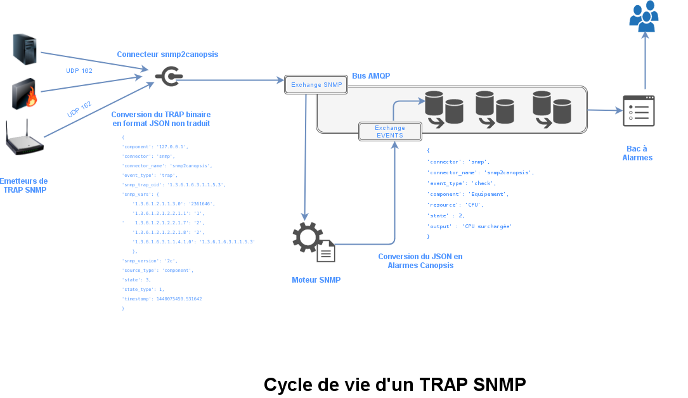

# SNMP trap vers Canopsis

Réceptionne les traps SNMP, les traduit grâce à un jeu de règles et les convertit en évènements.

!!! attention
    Ce connecteur n'est disponible que dans l'édition CAT de Canopsis.

    À noter aussi que ce moteur n'est actuellement pas fonctionnel en environnement Debian 8 ([bug #1456](https://git.canopsis.net/canopsis/canopsis/issues/1456)).

## Introduction

Ce guide décrit la réception et la traduction de traps SNMP pour Canopsis.

Bon nombre d'équipements émettent des traps. Canopsis est en mesure de :

1. les réceptionner ;
2. les traduire grâce à un jeu de règles ;
3. les convertir en évènements.

Ce document vous guide pas à pas dans cette mise en œuvre.

## Schéma de fonctionnement

Ce schéma présente le cycle de vie d'un trap SNMP depuis son émission jusqu'à sa conversion en alarme Canopsis.



## Prérequis

Le moteur `SNMP` de Canopsis doit être démarré pour que les traps envoyés par
`snmp2canopsis` soient traités jusqu'au bout.

## Émission des traps SNMP

L'émission des traps SNMP n'est pas traitée dans ce guide dans la mesure où cela concerne les équipements en eux-mêmes.

Il faut configurer sur les différents émetteurs l'adresse du récepteur de traps
ainsi que son port : il s'agit de l'adresse du connecteur `snmp2canopsis` et du
port 162 (port par défaut d'un récepteur de traps SNMP).

## Connecteur snmp2canopsis

Le connecteur `snmp2canopsis` porte 3 missions :

1. Réceptionner les traps
2. Parser les traps et les transformer en JSON
3. Publier les messages JSON obtenus dans un exchange AMQP dédié sur Canopsis

### Configuration

#### Fichier de configuration

Le fichier de configuration du connecteur est `/etc/snmp2canopsis.conf`.

```ini
[snmp]
ip = 0.0.0.0
port = 162

[amqp]
host = localhost
port = 5672
user = cpsrabbit
password = canopsis
vhost = canopsis
exchange = canopsis.snmp
```

#### Écoute SNMP

La section `[snmp]` contient la configuration pour l'IP et le port d'écoute des traps SNMP.

Pour permettre l'écoute quelle que soit l'adresse de la machine hôte, mettre la valeur `0.0.0.0`.

Par défaut le port d'écoute est le 162.

#### Connexion RabbitMQ

La section `[amqp]` contient la configuration pour la connexion au bus RabbitMQ.

Il faut donc vérifier que l'URL et les identifiants qui y figurent sont les bons.

La section `host` est à remplir avec l'IP ou le nom DNS du RabbitMQ.

### Déroulement

#### Décodage des traps

Une fois réceptionnés, les traps sont décodés puis transformés en JSON.

Exemple de JSON en sortie du connecteur :

```json
{
  "component": "127.0.0.1",
  "connector": "snmp",
  "connector_name": "snmp2canopsis",
  "event_type": "trap",
  "snmp_timeticks": "2350066",
  "snmp_trap_oid": "1.3.6.1.6.3.1.1.5.3",
  "snmp_vars": {
    "1.3.6.1.2.1.2.2.1.1": "1",
    "1.3.6.1.2.1.2.2.1.7": "2",
    "1.3.6.1.2.1.2.2.1.8": "2"
  },
  "snmp_version": "1",
  "source_type": "component",
  "state": 3,
  "state_type": 1,
  "timestamp": 1440075343.725282
}
```

Le connecteur ne possédant aucune MIB, `snmp_trap_oid` et le tableau `snmp_vars`
contient les OID des éléments sans aucune traduction.

Les messages seront traduits ultérieurement, par le moteur `SNMP` de Canopsis.

#### Publication du JSON

Les traps transformés en JSON sont publiés dans le bus AMQP de Canopsis, dans
un exchange dédié : `canopsis.snmp`.

### Exécution

Pour faciliter les intégrations, nous utilisons des conteneurs `Docker` pour cette étape.

```sh
$ sudo docker run -v snmp2canopsisdata:/connector-snmp2canopsis/etc canopsis/canopsis-cat-connector-snmp:2.4

[2017-06-20 13:18:06.700607] INFO: snmp2canopsis: Read configuration from /connector-snmp2canopsis/etc/snmp2canopsis.conf
[2017-06-20 13:18:06.701409] DEBUG: amqp: Thread started
[2017-06-20 13:18:06.702131] INFO: amqp: Connecting to cpsrabbit@172.17.0.1, on canopsis
[2017-06-20 13:18:06.701857] INFO: snmp: Start SNMP listener on 0.0.0.0:162
[2017-06-20 13:18:06.707382] DEBUG: amqp: Read the snmp queue
```

La configuration associée est la suivante :

```ini
[snmp]
ip = 0.0.0.0
port = 162

[amqp]
host = 172.17.0.1
port = 5672
user = cpsrabbit
password = canopsis
vhost = canopsis
exchange = canopsis.snmp
```

### Test de fonctionnement

Afin de valider le fonctionnement, nous pouvons générer un trap SNMP.

Nous aurons besoin de la commande `snmptrap`.

Pour installer cette commande sous Debian :

```bash
apt-get install snmp
```

Pour installer cette commande sous RHEL/CentOS :

```bash
yum install net-snmp-utils
```

Pour le test, nous allons nous appuyer sur la MIB Nagios
[NAGIOS-NOTIFY-MIB][notify_mib] et sa dépendance [nagios-root][root_mib].

[notify_mib]: https://github.com/monitoring-plugins/nagios-mib/blob/master/MIB/NAGIOS-NOTIFY-MIB
[root_mib]: https://github.com/nagios-plugins/nagios-mib/blob/master/src-mib/nagios-root.mib

Les deux fichiers récupérés doivent être placés dans le répertoire des MIB
SNMP : `/usr/share/snmp/mibs`.

Puisqu'il s'agit de traps SNMP, il faut s'intéresser au type `NOTIFICATION TYPE` présent dans les MIB.

Pour notre trap de test, nous allons utiliser l'objet `nSvcEvent` :

```
 nSvcEvent  NOTIFICATION-TYPE
   OBJECTS { nHostname, nHostStateID, nSvcDesc, nSvcStateID, nSvcAttempt,
             nSvcDurationSec, nSvcGroupName, nSvcLastCheck, nSvcLastChange,
             nSvcOutput }
   STATUS  current
   DESCRIPTION
     "The SNMP trap that is generated as a result of an event with the service
     in Nagios."
   ::= { nagiosNotify 7 }
```

Voici la ligne de commande utilisée avec `snmptrap` pour générer le trap :

```sh
snmptrap -v 2c -c public ${IP_RECEPTEUR} '' NAGIOS-NOTIFY-MIB::nSvcEvent \
  nHostname s "Equipement Impacte" \
  nSvcDesc s "Ressource Impactee" \
  nSvcStateID i 2 \
  nSvcOutput s "Message de sortie du trap SNMP"
```

Le connecteur reçoit ce trap, le convertit en JSON et le transmet à Canopsis
dans l'exchange `canopsis.snmp`.

Le JSON produit par le connecteur peut être vérifié dans les logs du service
ou conteneur `snmp2canopsis`. Exemple de log :

```
[2019-06-20 08:27:44.754789] INFO: snmp2canopsis: Read configuration from /etc/snmp2canopsis.conf
[2019-06-20 08:27:44.791038] INFO: snmp: Trap debug enabled
[2019-06-20 08:27:44.791343] DEBUG: amqp: Thread started
[2019-06-20 08:27:44.791476] INFO: amqp: Connecting to cpsrabbit@rabbitmq, on canopsis
[2019-06-20 08:27:44.919838] DEBUG: amqp: Read the snmp queue
[2019-06-20 08:27:44.920357] INFO: snmp: Start SNMP listener on 0.0.0.0:162
{'component': '172.18.0.1',
[2019-06-20 08:30:12.654219] DEBUG: snmp: {'component': '172.18.0.1',
 'connector': 'snmp',
 'connector_name': 'snmp2canopsis',
 'event_type': 'trap',
 'snmp_trap_oid': '1.3.6.1.4.1.20006.1.7',
 'snmp_vars': {'1.3.6.1.2.1.1.3.0': '19463',
               '1.3.6.1.4.1.20006.1.1.1.2': 'Equipement Impacte',
               '1.3.6.1.4.1.20006.1.3.1.17': 'Message de sortie du trap SNMP',
               '1.3.6.1.4.1.20006.1.3.1.6': 'Ressource Impactee',
               '1.3.6.1.4.1.20006.1.3.1.7': '2',
               '1.3.6.1.6.3.1.1.4.1.0': '1.3.6.1.4.1.20006.1.7'},
 'snmp_version': '2c',
 'source_type': 'component',
 'state': 3,
 'state_type': 1,
 'timestamp': 1561019412.652676}
```

## Suite

La suite de la configuration concerne le traitement des traps décodés.

Si les traps peuvent faire l'objet de règles de traitement grâce à des MIB,
se référer à la documentation du
[moteur `snmp`](../../guide-administration/moteurs/moteur-snmp.md).

Si les traps ne sont pas standard, ou en l'absence de MIB, se référer à la
documentation sur les [traps SNMP custom](./SNMPtrap_custom.md).
