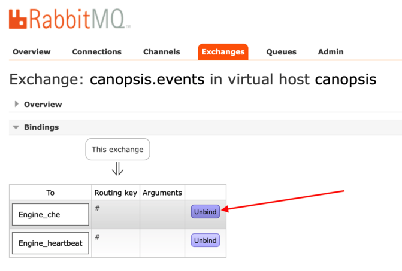
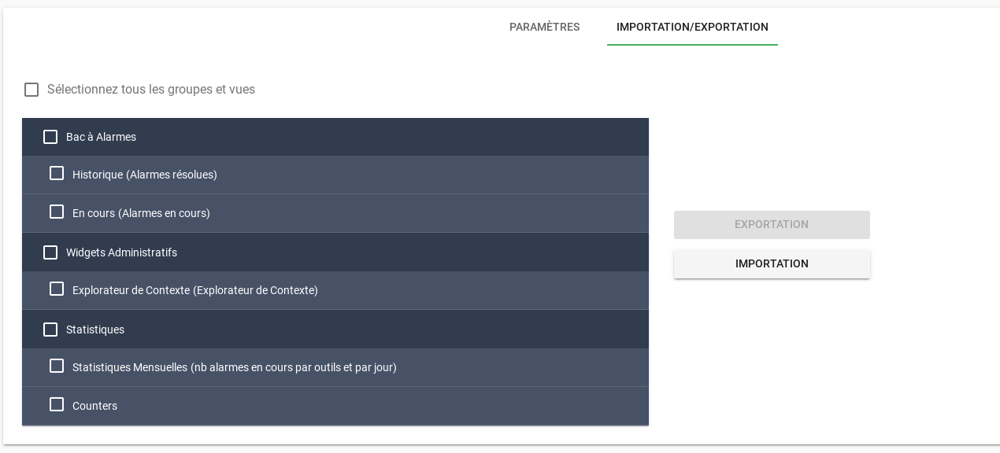

# Notes de version Canopsis 3.39.0

Canopsis 3.39.0 a été publié le 10 avril 2020.

## Procédure d'installation

Suivre la [procédure d'installation de Canopsis](../guide-administration/installation/index.md).

## Procédure de mise à jour

Suivre la [procédure standard de mise à jour de Canopsis](../guide-administration/mise-a-jour/index.md).

Vous devez ensuite vous [connecter à l'interface de RabbitMQ](../guide-administration/troubleshooting/rabbitmq-webui.md) pour y apporter quelques changements.

Allez dans Exchanges > `canopsis.events` > Bindings, et cliquez sur le bouton « Unbind » de la file `Engine_che` :



Puis, en fonction de votre méthode d'installation, effectuez les manipulations suivantes.

### Manipulations supplémentaires en environnement Docker

Redis doit être mis à jour vers sa version 5. La variable de référence (habituellement définie dans un fichier `.env`) utilisée est la suivante :

```ini
REDIS_TAG=5.0.8-buster
```

Si vous utilisez les moteurs Go, vous devez obligatoirement ajouter le nouveau moteur `engine-fifo` suivant à votre `docker-compose.yml` :

```yaml
  fifo:
    image: canopsis/engine-fifo:${CANOPSIS_IMAGE_TAG}
    env_file:
      - compose.env
    restart: unless-stopped
    command: /engine-fifo
```

Si vous utilisiez le moteur `engine-che` avec l'option `-alwaysFlushEntities`, celle-ci n'a plus d'utilité et doit obligatoirement être supprimée.

En édition CAT, si vous utilisez les moteurs `engine-webhook` et `engine-dynamic-infos`, vous pouvez simplifier les points d'entrée en supprimant les paramètres `-publishQueue`, si vous les aviez exactement positionnés aux valeurs suivantes :

```yaml hl_lines="9 18"
  dynamic-infos:
    image: canopsis/engine-dynamic-infos:${CANOPSIS_IMAGE_TAG}
    env_file:
      - compose.env
    depends_on:
      - "mongodb"
    restart: unless-stopped
#   command: /cmd/engine-dynamic-infos -publishQueue Engine_webhook
    command: /cmd/engine-dynamic-infos
  webhook:
    image: canopsis/engine-webhook:${CANOPSIS_IMAGE_TAG}
    env_file:
      - compose.env
    depends_on:
      - "mongodb"
    restart: unless-stopped
#   command: /cmd/engine-webhook -publishQueue Engine_action
    command: /cmd/engine-webhook
```

Relancez l'ensemble de votre environnement avec `docker-compose up -d`. Assurez-vous que le conteneur de provisionnement RabbitMQ `init` ait bien à nouveau été exécuté.

### Manipulations supplémentaires en installation par paquets

Redis doit être mise à jour vers sa version 5. Cette manipulation n'est facilement réalisable que dans le cadre d'une **nouvelle** installation de Canopsis avec `canoctl`.

Si vous utilisez les moteurs Go, vous devez activer le nouveau moteur `engine-fifo`, et forcer la création de sa file RabbitMQ associée :

```sh
systemctl enable canopsis-engine-go@engine-fifo
cp /opt/canopsis/etc/initialisation-cat.toml.example /opt/canopsis/etc/initialisation.toml
set -o allexport ; source /opt/canopsis/etc/go-engines-vars.conf
/opt/canopsis/bin/init -conf /opt/canopsis/etc/initialisation.toml
```

Supprimez toute référence à l'option `-alwaysFlushEntities` du moteur `engine-che`, si vous l'utilisiez :

```sh
vi $(grep -lr alwaysFlushEntities /etc/systemd/system/canopsis*)
systemctl daemon-reload
```

Vous devez ensuite resynchroniser votre fichier `amqp2engines.conf` avec les fichiers de référence suivants présents dans `/opt/canopsis/etc` :

*  `amqp2engines-go-cat.conf.example`
*  `amqp2engines-go-core.conf.example`
*  `amqp2engines-python-cat.conf.example`
*  `amqp2engines-python-core.conf.example`

## Changements entre Canopsis 3.38.0 et 3.39.0

### Nouveau rythme de publication des nouvelles versions

Afin d'apporter de meilleures garanties sur les livrables, le rythme de publication de nouvelles versions de Canopsis passe maintenant de 2 à 3 semaines.

Les sprints de développement interne se poursuivent néanmoins sur leur rythme habituel de 15 jours.

### Nouveaux helpers Handlebars

De nouveaux helpers Handlebars propres à Canopsis ont été ajoutés :

*  `{{sum}}`, `{{minus}}`, `{{mul}}`, `{{divide}}` :  afin d'effectuer les opérations mathématiques basiques sur des nombres.
*  `{{concat}}` : afin de concaténer des chaines de caractères.

Consultez la [documentation des helpers Handlebars propres à Canopsis](../guide-utilisation/interface/helpers/index.md), afin d'en savoir plus.

### Nouveau mécanisme d'importation et d'exportation de vues

Les vues créées dans Canopsis peuvent maintenant être importées et exportées entre différents environnements, en quelques clics sur l'interface.



### Améliorations diverses du vocabulaire du Bac à alarmes

Certaines parties du vocabulaire présent dans l'interface de Canopsis ont été revues dans les traductions françaises et anglaises.

Par exemple, *l'état* d'une alarme, qui pouvait être confondue avec son *statut*, s'intitule dorénavant *criticité*. Des termes internes tels que *rrule* ont maintenant été traduits en des termes plus clairs, tels que *récurrence*.

Seule l'interface web est concernée par ces changements ; la base de données, les API et les connecteurs utilisent toujours les noms de champs historiques, par compatibilité avec l'existant.

### Déploiement facilité des moteurs CAT avec `canoctl deploy`

Si vous disposez d'une souscription à l'édition CAT de Canopsis, la commande de déploiement `canoctl deploy` est maintenant capable de déployer les moteurs CAT, sans nécessiter une quelconque manipulation supplémentaire.

(Ceci n'est valable que pour une nouvelle installation de Canopsis et de ses paquets.)

### Mise à jour du serveur de cache Redis

En environnement Docker, ou en installation par paquets, [Redis](https://redis.io) a été mis à jour d'une version 3 à une version 5, avec une configuration revue. Cette mise à jour est nécessaire au bon fonctionnement du nouveau moteur Go `engine-fifo`.

Voyez la procédure plus haut, pour les détails de cette mise à jour.

### Améliorations diverses du Guide d'administration

Certaines parties du [Guide d'administration](../guide-administration/index.md) ont été revues ou améliorées. Ce travail de fond se poursuivra lors des prochaines mises à jour de la plateforme de documentation.

### Liste des modifications

*  **Images Docker / paquets :**
*  **Documentation :**
    *  Documentation de la fonctionnalité d'importation et d'exportation de vues Canopsis ([#2311](https://git.canopsis.net/canopsis/canopsis/issues/2311))
*  **API :**
*  **Connecteurs :**
    *  **email2canopsis :**
        *  (XXX)
*  **UI :**
    *  **Bac à alarmes :**
    *  **Calendrier :**
        *  Correction d'un bug de positionnement de date ([#2304](https://git.canopsis.net/canopsis/canopsis/issues/2304))
    *  **CRUD Actions :**
    *  **CRUD Dynamic Infos :**
        *  La mise à jour de l'auteur d'une règle est maintenant opérationnelle ([#2283](https://git.canopsis.net/canopsis/canopsis/issues/2283))
    *  **CRUD Event-filter :**
    *  **Linklist :**
        * Les liens sont maintenant triés par ordre alphabétique ([#2282](https://git.canopsis.net/canopsis/canopsis/issues/2282))
    *  **Widgets :**
        * Ajout d'un nouveau widget « Compteur » ([#2247](https://git.canopsis.net/canopsis/canopsis/issues/2247))
* **Expérience utilisateur :**
    *  Amélioration des traductions au travers de toute l'interface ([#2278](https://git.canopsis.net/canopsis/canopsis/issues/2278))
