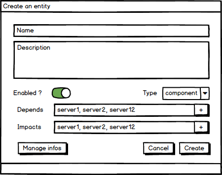
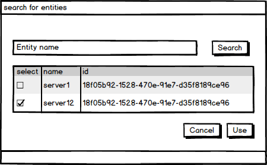

# The context-graph Explorer

The context-graph explorer is a tool integrated into Canopsis to manage the CIs (entities) that are stored in Canopsis, and perform mass actions on these entities. 


## Data model

There are 4 types of entities to manage :

* resources
* components
* connectors
* watchers

The `connectors`, `components` and `resources` have the same structure : 


| column name     | type           | comment                                               |                    
|-----------------|----------------|-------------------------------------------------------|
| _id             | string         | unique ID of the entity                               |
| impact          | array[string]  | array of _id of the entities that this entity impacts |
| name            | string         | name of the entity                                    |
| enable_history  | array[integer] | array of timestamps where the Entity was enabled      |
| disable_history | array[integer] | array of timestamps where the Entity was disabled     |
| measurements    | object         | unused. Empty object                                  |
| enabled         | boolean        | true if the entity is enabled, false otherwise        |
| depends         | array[string]  | array of _id of the entities this entity depends on   |
| infos           | object         | Extra informations defined by the customer            |
| type            | string         | `connector` or `component` or `resource`              |


`Watchers` have a different structure (TODO)


###Example 
 
 * `resources` 
 
 ```json
  {
    "_id" : "component:PRD_130_VM.resource:Dummy/heartbeats", 
    "impact" : [ 
        "heartbeats"
    ],
    "name" : "component:PRD_130_VM.resource:Dummy",
    "enable_history" : [ 
        1526401484
    ],
    "measurements" : {},
    "enabled" : true,
    "depends" : [ 
        "heartbeat/heartbeat"
    ],
    "infos" : {},
    "type" : "resource"
}
 ```

 * `components`

```json
{
    "_id" : "c12e749ca28d",
    "impact" : [],
    "name" : "c12e749ca28d",
    "enable_history" : [ 
        1526401469
    ],
    "enabled" : true,
    "depends" : [ 
        "Engine_eventstore/c12e749ca28d", 
        "Engine/engine"
    ],
    "infos" : {},
    "type" : "component"
}
```

* `connectors`

```json
{
    "_id" : "Engine/Newtest PRD_180_VM",
    "impact" : [ 
        "Dummy/PRD_180_VM", 
        "PRD_180_VM"
    ],
    "name" : "Newtest PRD_180_VM",
    "enable_history" : [ 
        1526401730
    ],
    "measurements" : {},
    "enabled" : true,
    "depends" : [],
    "infos" : {},
    "type" : "connector"
}
```

## Features

### List entities

The context-explorer should display a list of entities in a table similar to the alarms-list
The list must contain the following columns: 

  - a checkbox to select one or several entities
  - id 
  - type
  - name
  - a configurable set of "info" fields

Each column can be used to sort the data. The user can define the default sort column an sort direction in the Explorer's settings

### Create an entity

To create a new entity, a form must be created with the following fields

| Field name      | type           | comment                                                            |       
|-----------------|----------------|--------------------------------------------------------------------|
| name            | text field     | name of the entity                                                 |
| enabled         | on-off switch  | true if the entity is enabled, false otherwise                     |
| impact          | component      | dedicated component to manage adding/removing several impacts      |
| depends         | component      | dedicated component to manage adding/removing several dependencies |
| infos           | component      | Extra informations defined by the customer                         |
| type            | select         | `connector` or `component` or `resource`                           |


Here is a mockup of the form



Impact/depends and infos have a more complex UI, described below


#### Component for impacts/dependencies

The impact and dependencies are actually other entities, linked to the current entity using an array of `_id`

That means that when an user creates an entity, he/she must be able to search for other existing entities and associate them with the current entity in the creation form. 

The impact/depends form is a component that allows the user to search for entities and select them.

The component is divided in 2 parts : 

- A search field that allow to search for entities by name
- a list that displays the search results

The user can select the entities to associate and validate, or cancel. 




#### Component for infos	


### Update an entity

Updating an entity uses the same form as for the creation, but filled with the current attributes of the selected entity

### Delete an entity

Deleting an entity triggers a confirmation dialog with Yes/No buttons. Only clicking on the "Yes" button triggers the deletion


### Manage An entity's infos 

The info field of an entity is a dict enabling the user to store administrative information about the entity (ex: IP address, administrator name, environment). 
An info is an object composed of 3 properties: 

| property    | type   | comment                                     |
|-------------|--------|---------------------------------------------|
| name        | string | Technical name of the info (must be unique) |
| description | string | description of the info                     |
| value       | string | value of the info                           |


#### Add an Info object to an entity

A form containing 3 fields must be displayed: 

| Field       | type       | Comment                                                                                                 |
|-------------|------------|---------------------------------------------------------------------------------------------------------|
| Name        | Text field | A check should be implemented to ensure that name is unique. Characters allowed: alphanumeric and dots. |
| Description | Textarea   | Html should be escaped to avoid code injection                                                          |
| Value       | Text Field | Html should be escaped to avoid code injection                                                          |

#### view infos from an entity

TBD 

#### Update an info 

Updating an info triggers the same form as for the Info creation, but fileld with the current information for the selected info

#### Delete an info

Deleting an info triggers a confirmation dialog with Yes/No buttons. Only clicking on the "Yes" button triggers the deletion


### Actions to perform on an entity

The entities are displayed in a list, and can be selected through the checkbox in the first column of the list.

The following actions should be available above the list, and can be applied on one or several entities

- Remove entities
- Apply pbehaviors

