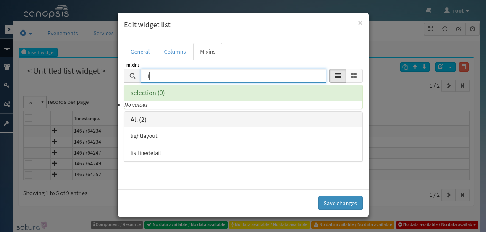
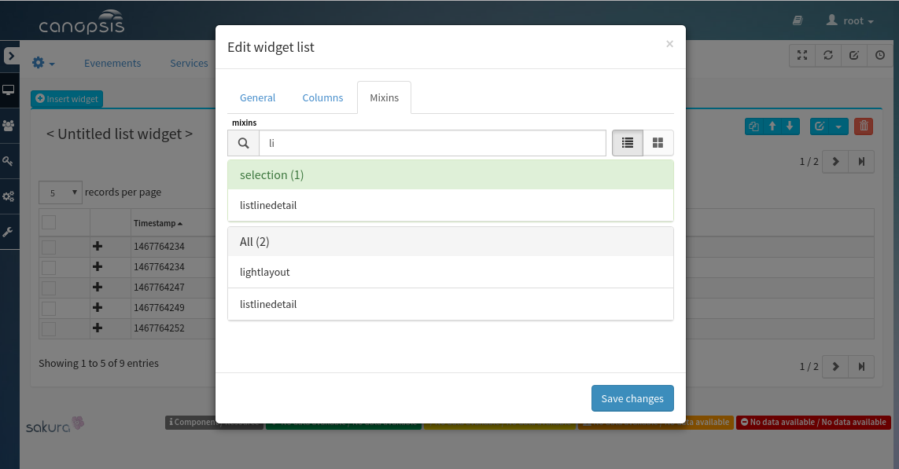
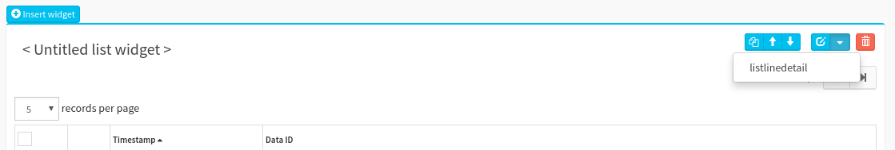
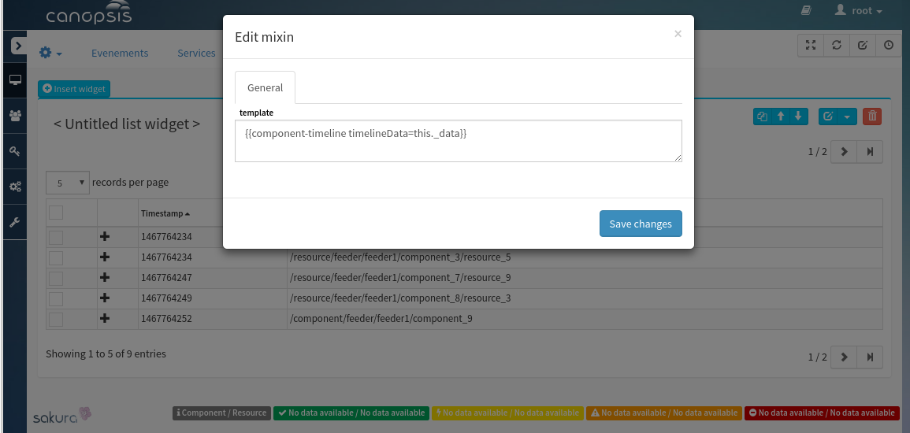
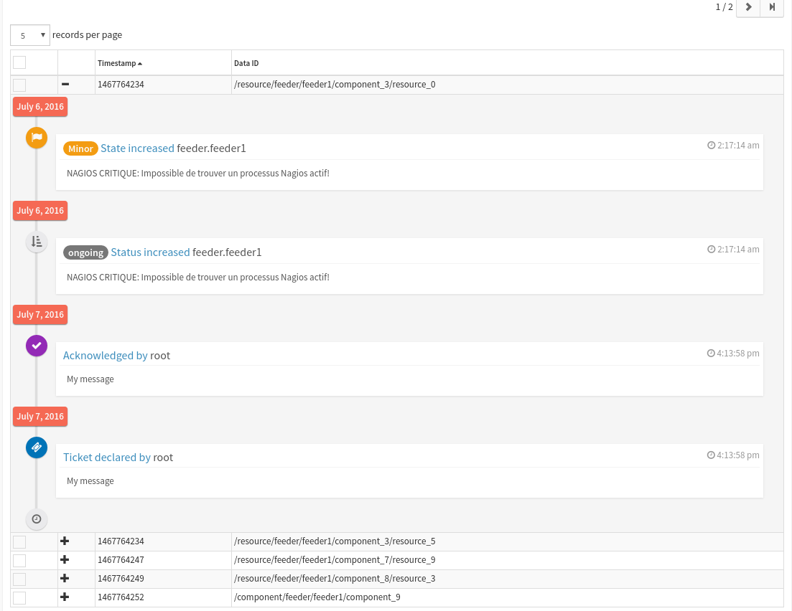

.. _ED__WidgetTopology:

========================
Canopsis Widget Topology
========================

This document describes how to use the widget topology in Canopsis

.. contents::
   :depth: 2

References
==========

List of referenced functional requirements...

- `fr__WidgetTopology.rst <../FR/fr__WidgetTopology.rst>`_
- `tr__WidgetTopology.rst <../TR/tr__WidgetTopology.rst>`_

Updates
=======

.. csv-table::
   :header: "Author(s)", "Date", "Version", "Summary", "Accepted by"

   "Tristan Carranante", "", "0.1", "Document creation", ""

Contents
========

.. _ED__Title__Desc:

Installation
------------

Brick installation
~~~~~~~~~~~~~~~~~~

To install the brick in Canopsis, please follow the README instruction `here <https://git.canopsis.net/canopsis-ui-bricks/brick-timeline#installation>`_

Brick use
~~~~~~~~~

We're going to use the timeline component in a widget list. First you need to edit your widget list and search for "listlinedetail" in the tab "mixins".

Select it and save changes:

Then go in the mixins list and click on the listlinedetail :

Now you must provide the "alarm" element to the component, if you use the adapter shipped with this component try the following template :  {{ component-timeline timelineData=this._data }}

Finally you're rewarded by a beautiful timeline 

If you want to use it somewhere else remember that you must pass in your template one "alarm" type to the timelineData attribut.