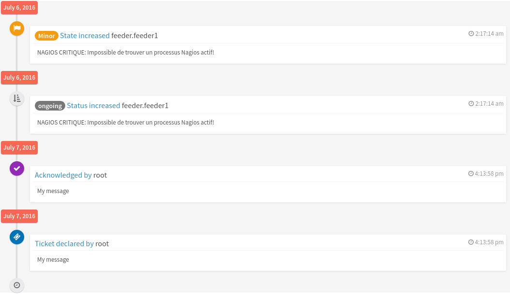

.. _FR__TopologyWidget:

========================
Canopsis brick timeline
========================

This document describes the component timeline features.

.. contents::
   :depth: 3

References
==========

Updates
=======

.. csv-table::
   :header: "Author(s)", "Date", "Version", "Summary", "Accepted by"

   "Tristan Carranante", "22/07/16", "0.1", "Document creation", ""

Contents
========

.. _FR__Title__Desc:

Description
-----------

The timeline component is used to display alarm steps in chronological order. This
component depends heavily of adminLTE design, used icons are font awesome. A new adapter
is provided.

